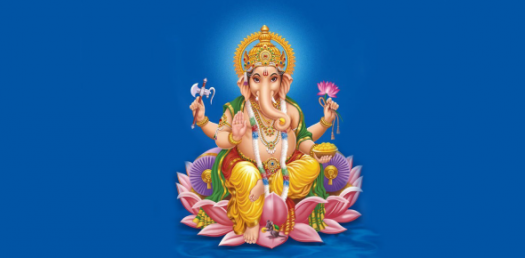

###   प्रकाशकीय  

जान्न खोज्ने र बुझ्न चाहने स्वभावले मानिस मानिसमा दरियो । आफुसमेत भएको समूहको चित्रमा मान्छे आफैँलाई नियाल्न मा पराउँछ र बुझ्न चाहन्छ । यस्ता काम आत्मरति भए पनि यसबाट मुक्त हुन सायद कस्तै महात्मा पनि सक्दैन्न् । ‘‘म” को खोजि गर्दै लाँदा नालीबोलि र फेद पहिल्याउन मन पराउँछन् मान्छेहरु । भेटिएसम्म अतितका  तन्तूलाई कोट्याउने र लहरो तान्ने जमर्को इतिहासकै पाटो भन्दा पनि हून्छ कि ? पितृ सत्ताप्रधान हाम्रा सामाजिक बनोटले गर्दा मातृपक्षको उपेक्षा हुनूचाहि अन्य बंशवालीमा झै यसमा पनि त्यो अर्घेल्याई भएको छ र स्वीकार्नै पर्छ । ऋषि परम्पराबाट आगत ‘आत्रेय’ गोत्र र स्थल वा थलो (ठाृउँ) बाट निर्मित ‘‘सिग्देल” थरको एक सानो अध्ययनको प्रतिफलमात्र स्वीकार्नु हुनेछ भन्ने पुर्ण आशामा छौ ।

- सिग्देल सेवा समाज
केन्द्रय कार्यालय
काठमाण्डौं

