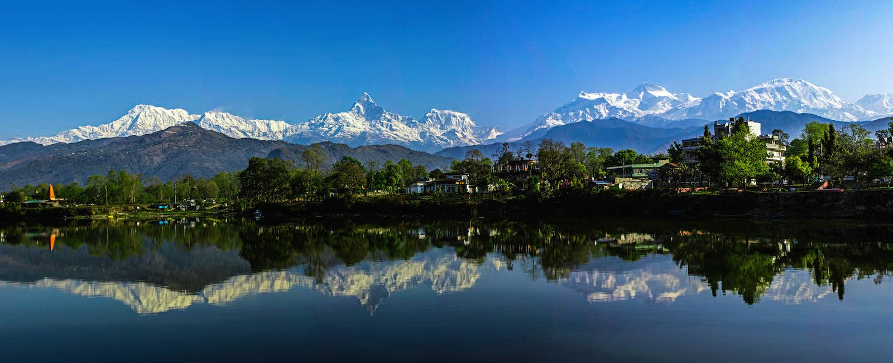

### देउरालीमा एक थुँगा फूल


अन्तमा लयप्रलयको खेलहरु चलिरहे , संकूचन विस्फोटनहरु भईरहे , निर्माण र विनासका घटनाहरु दोहोरीरहे । समय मात्र त्यसको प्रत्यक्ष्यदर्शी साक्षी भयो , त्यसैले ती महाप्रलयका सन्सनीपुर्ण तमासा हे¥यो ,मुकदर्शक भएर । कति आकाशीय पिण्डहरुका  स्वरुप बिग्रीय, कतिको अस्तीत्व नै समाप्त परे , कति संकुचन भै विलीन भए । अनादिदेखि चलेका ती अथलपुथलहरुलाई उही लाटो समयले मात्र हे¥यो, अनभव ग¥यो । मानव मस्तिष्कले सोच्नै नसक्ने, मननातित विस्फोटन र संकुचनहरुका आघोपान्त अनुभुति सम्म गर्न  अल्पजीवी मान्छेले नसक्ने हुनाले चेतनाको विकास गरेपछि ती रहस्यहरुका बारेमा बुझ्ने प्रयत्न ग¥यो । कति बुझयो कति बुझेन , कति आंशिक बुझ्यो कति कल्पनातीत  हुँदा त्यसलाई अगम्य भन्यो अनि पृथ्वीबाट हेर्दा देखिने अथाह आकाशलाई उन्नत भनेर चित्त बुझाउन खोज्यो ।

यो अन्नत रहस्यभित्रको एउटा पिण्ड हो पृथ्वी । पृथ्वीलाई घटाएर महादेश, क्षेत्र, बीस्ती, समाज, परिवार र त्यो भित्रको एउटा मान्छे  हो व्यक्ति । यसरी हेर्दा व्रह्माण्डको अगाडि व्यक्ति बिन्दु भन्दा पनि साना , अणु अझ परमाणुभन्दा पनि सुक्ष्मझैं प्रतीत हुन्छ उसको अस्तित्व । तर प्रबल चेतनाको धनि , मान्छेले जिज्ञासा राख्न कहिल्य छाडेन, थाकेन । तिनलाई चाहे ऋषि मुनि भनौ चाहे वैज्ञानिक भनै चाहे अन्बेषक या अनूसन्धाता भनौ केहि फरक पर्दैन । तिनले केह िरहस्यहरुको उद्घाटन पनि गरिदए तर ब्रह्माण्डको पुर्णज्ञान यासअघि न कसैले प्राप्त ग¥यो न भविष्यमा सम्भाव ह्ुनेछ ।

स्वभावतः खोजिकै क्रममा व्यक्तिले आफ्नो प्राचिन उद्गमहरु प्नि खोतल्न थाल्यो । पुस्ता पुस्ता सरेर जाने वंशतन्तु(जीन्स) हरुको समेत अध्ययन गर्न थाल्यो, त्यसका असर कसरका बारेका जानकारी लिन थाल्यो। किन भने मानिस चुप लागेर बस्नै सक्तैन । अझ बढी गरौँ, अझ धेरै जानौँ भन्ने स्वभावकै कारणले ऊ मान्छे भनिएको हो । दिनानुदिन ऊ प्रकृतिमाथि अतिक्रमण गर्दै र सृष्टीको भविष्य कता पुगर टुङ्गिने हो कसैलाई थाहा छैन । मानिसलाई स्वतन्त्र छोडन पाइएन किन भने ऊ केही उपद्रव गरिरहन्छ । त्यसैले यसलाई राज्यका सीमानाले बाँधियो , धर्मका अङ्कुशहरु लगाईयो , नैतिकताका सुक्र्यौनी गाठाँहरुले कसियो संस्कारका मोहहरुले रङ्गइयो , जाति र वंशप्रेमका कथाहरुले लोभ्याइयो अनि त्यही निर्दिष्ट बाटोमा हिँड्नको लागि नियम कानुन बनाइयो । त्यो कानुनलाई कुनै बेला धििर्मक आस्था जोडेर पुजा गर्न लाइयो, त्यसभित्र स्वर्ग र नर्क देखाइयो र कुनै बेला संविधान  अनि ऐन भनियो , जेल नेल र स्वतन्त्रताका बाटाहरुको व्याख्या गरियो । वास्तवमा मानिस यिनै कानुनभित्रका आस र त्रासले गर्दा यति धेरै सज्जन भएको हो , सभ्य कहलाइएको हौ ।
प्रथमतः मानिस निवी स्वार्थसंग नै बढी सरोकार राख्दछ । किनभने पहिले उ व्यक्ति हो । विश्ववन्धुत्वको सोपान चढिसकेको असाधारण व्यक्तिले भन्ला —

```
खोज्छन सबै सुख भनी सुख त्यो  काहाँ छ ?
आफु मिटाई अरुलाई दिनू जहाँ  छ ||
```

तर केहि मानिसले मुखले त्यसो भन्लान् तर व्यवहारले प्रमाणित गर्न सक्दैननन् । मानिस मन , वचन र कर्मकै दरिद्र हून्छन र केवल आफुमा नै केन्द्रित बन्न पुग्छन् । हामी पनि त्यही तथ्यको हाराहारीमा छौ । त्यसैले होला अहिले हामीलाई विश्वप्रेमभन्दा बन्धुप्रेमको मोह जाग्यो । आत्रेयगोत्री सिग्देलहरुको पुख्यौँली नालीबेली यतुकिञ्चत् सङ्कलन गरौँ भन्ने लोभ लाग्यो । हाम्रो वैदिक एवं सनातन धर्मग्रन्थहरुमा वर्णित अत्रि ऋषिका शाखा सन्तानहरुको खोजमेल गरी रङ्गनाभ हुदै श्री कृष्णसम्म र त्यसपछिका लहराहरु प्नि विभिन्न विद्दानहरुले उल्लेख गरी सकेका नाम नामेसीको सम्पादन गर्ने क्रममा यथासम्भव सिग्देलहरका घर दैला पुग्न प्रयास पनि गरियो । ऋषि अत्रिदेखि वर्तमान पुस्तासम्मको सच्य तथ्य यही जै हो भनि ठोकुवा गर्ने काम पनि दुरुह नै हो । त्यसैले हाम्रो धर्म शास्त्रहरुमा वर्णित आधारहरु विद्दान्हरुले यस पुर्व उल्लेख गरी सकेका प्रमाणहरु र हामीले खोजमेल गरेका विवरणहरुको संयोजनमात्र बाँकी छ , क्रमिक संशोधन जरुरी छ । त्यसैले यसलाई हामीले पहिलो संस्करण नाम दिएका हौँ ।



वंशावलीको खोजमेल गरौँ भनेर वर्षैदेखि सिग्देल बन्धुहरुले आवाज उठाइरहे तापनि यसको श्रेय विगतमा दहचेकबाट ताप्लेजुङ्ग र त्यसपछि झापा झरेका सिग्देलहरुलाई जान्छ ।वहाँहरुले विगत दश वषर््ा देखि यसको खोजतलाश शुरु गर्नु भयो । भाइ दुर्गा सिग्देललाई सम्भव भएसम्म नेपाल अधिराज्य भित्रका सिग्देलहरुका घर वस्तीसम्म पटक पटक पठाई विवरण संकलन गरिरहनू भयो । स्वअध्ययनबाट र दुर्गा भाइले संकलन गरी ल्याएका सामाग्रीहरुको झापा , बुधबारे—४ निवासी अग्रज श्री पुरुषेत्तम सिग्देलले यसको पुरै अशं मस्यौदा गर्नू भयो । यता काठमाण्डौँमा पनि वंशावलीको रहर र चासो बढेकोै थियो । यसै क्रममा मिति २०५८।४।२७ मा काठमाडौँमा बसेको सिग्देलहरुको भेलाले ‘‘सिग्देल सेवा समाज” को विधिवत् गठन ग¥यो । यो समाजले झापाका बन्धुहरुलाई समेत समेट्यो । यस प्रकार झापाबाट मस्योदा भई आएको वंशावलीलाई हेरी भिडाई यो समाजले प्रकाशनमा ल्याएको हो । यसमा वंशावलीको परम्परागत शैलीका साथै नृवशंको पाटो पनि जोड्न सान्दर्भिक हुने र समानान्तर रुपमा यसलाई हेर्ने सकियोस् भन्ने उदेश्यले सो समेत समावेस गरीएको छ ।

वास्तवमा वंशावली अन्वेषणको विषय भएकोले दुरुह हो । निरन्तर र अविराम यसैमा लागिरहने धैर्यवान्ले मात्र यसको  आदि मध्य अन्तको रुपरेखा दिन सक्तछ । एउटा रमाईलो के पनि भयो भने सिग्देल सेवा समाजको गठन यस्ता व्यत्तिशरुलाई समावेश गरेर वनाइयो वास्तवमा कसैलाई पनि फुर्सद छैन । सबै व्यस्त छन् , अत्यन्त व्यस्त । त्यसको असर यो वंशावली प्रकाशनमा ल्याउने कामा प्रत्यक्षनै पर्न गयो । टाइप गर्ने काम , सच्याउने काम , मिलाउने काममा समय निकाल्न ज्यादै कठिनाइ प¥यो । पटक पटक झापा देखि दाई पुरुषोत्तम र भाइ दुर्गालाई काठमाडौँ सम्म दुःख दिई बोलाइरहनू प¥यो । वहाँहरु आई नै रहनु भयो । यसरी ओहोर दोहोरको काममा दुःख दिनु परेकोमा समाजको तर्फबाट मैले क्षमा माग्नू पर्छ

यसका साथै यसलाई पटक पटक टाइप गरी सहयोग गर्नु भएका सबै व्यक्ति विशेष लाई हार्दिक धन्यवाद दिनु हाम्रो कर्तव्य नै हुन्छ । यति हुदाँ पनि कतिपय कुराहरुमा हाम्रा ढङ्गनपुगेर  कतिपय स्थानमा बसोबास गर्ने सिग्देल बन्धु समक्ष गई भेट गर्ने समय नमिलेर र कतिपय कुराहरु खोज्नै गाह्र्रो परेर वंशावलीको पहिलो संसकरण मानी यसलाई हतार मै हामीले प्रकाशनमा ल्याएका हौँ । वास्तवमा खोज भन्ने कुरा कहिल्यै पुरा नहुने  हुनाले पनि यत्किञ्चित् हाइजार्नीको आकार दिन सके मासू भर्ने काम , अन्य विन्यास गर्ने काम र प्राण दिने काम यस पछिका संस्करणका क्रमशः हुदैँ जानेछन् भन्ने हाम्रो विश्वास पनि हो । त्यसैले कतै छुट भएको वा कतै अतिशयोक्ति नै पर्न गएको रहेछ भने पनि त्यसलाई यो खोजको प्रथम प्रयास रहेछ  भन्ने दृष्टिकोणले हरिदिनु हुनेछ भन्ने हामीलाई विश्वस छ ।

अन्तमा समाजको सक्रीय सदस्य रही यकिो प्रकाशनमा अनवरत सहयोग गर्ने सबै पदाधिकारी बन्धुहरु र प्रकाशनका  लाीग लाग्ने धनराशिका लागि आजीजन सदस्य बनी जे जसले रकम दिनु दिलाउनु भो वहाँ हरुलाई यथायोग्य हार्दिक धन्यबाद दिदै यसको अर्को संस्करणमा यसमा पर्न गएका त्रुटिहरु सच्याउन पुर्ववत् सल्लाह र सझाव दिनु हुनेछ भन्ने आशा लिदैँ बिदा माग्दछु ।


२०६१।४।१
भुवनहरी सिग्देल
अध्यक्ष
सिग्देल सेवा समाज


