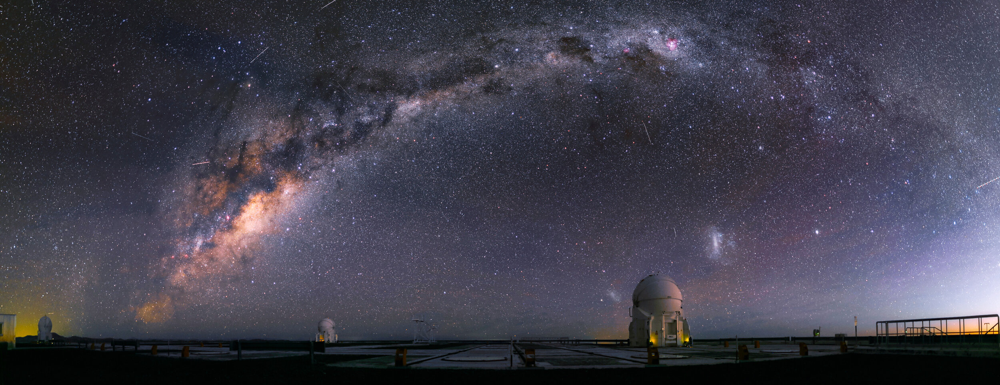

###  मानव सृष्टिका विश्लेषणहरु

#### क. दैंवी सिद्धन्त

यो बूह्माण्ड र चराचरको सृष्टि कुनै अदृश्य शक्तिको करामत हुनुपर्दछ भनेर प्रायः विश्व भरकै मानिसहरुले मानिएकाृ दैवी सिद्धान्त उन्नाइसौं शताव्दीको मध्यावधि सम्म लोकप्रिय र एक छत्र रुपमा स्थापित सिद्धन्तको रुपमा रहिआएको छ । त्याृ अदृश्य शक्ति चाहिं इश्वर , भगवान ,प्रभु, अल्लाह आदि – विभिन्न नाम र अनेक चरित्रहरुमा बखानियो । प्रायः संसार भरकै जात जातिका आख्यानहरुले यस्तो रहस्यपुर्ण र चमत्कारको अथाह काम कुनै अदृश्य, सर्वव्याप्त शक्तिमान तत्वको जादुबाटमात्र सम्भव हुनुपर्दछ  भन्ने अर्थमा ईश्वरवाद वा प्रत्ययवादको प्रतिपादन भयो । यो अवस्थासम्म सृष्टिका रहस्यको बारेमा जे जति खोज अनुसंन्धानहरु भए , इतर ईश्वरवाद दर्शन र खोजहरु इा त नष्ट गरिए अथवा ज्यादै कमजोर रुपमा इतिहासको गर्भमा लुकिरहे । कतिपय अनीश्वरवाद दर्शनहरुको उदाहरण लिनु पर्दा सबभन्दा प्रचिीन मानिएको चार्वाक् दर्शन र लुकेर ईश्वरवाद मान्नेमा चाहिं वुद्ध दर्शन लाई लिन सकिन्छ । यस्तो अत्यन्त रहस्यपुर्ण ब्रह्माण्डको सृष्टि र वीसौंलाख जीवात्माहरुको अस्तित्व अनि सृष्टि वारेमा युक्ति र तर्कले वास्तविक विश्लेषणपुर्ण प्रतिस्थापन गर्नु भन्दा लगेर त्यही ईश्वरलाई जिम्मा लगाउनु माथापच्चिसी गर्ने भन्दा सजिलो भयो । यसै क्रममा भारतवर्ष र यसको सेरोफेरोमा जीवन र जगतलाई पर्गेल्नलाई विभिन्न रौंचिरा दर्शनहरु प्रतिपादन नभएका होइनन् तर तिनीहरुलाई पनि कतिले घुमाई फिराई प्रकृतिपुरुष, कार्यकरण वा परब्रह्म जे भनेर भए पनि ईश्वरलाई नै सृृष्टिको आद्यस्रोत स्वीकार्ने थिए । हाल एक्काइसौं शताव्दीमा पनि आफु कुनै अदृश्यको अवतार नै भनेर मानिनेहरु छदैछन् र पछिपनि त्यस्ता अवतारीहरु नहोलान भन्न सकिएन । कति अवतारीहरु त जिस्थापित हुदाँ पनि अझै नटसमसाउनेमा छन् । अथवा अनुयायीहरुले जबरवस्ती अवतारांशमा थेगाएका छन्। यही सिद्धान्त नै दैवी सिद्धान्त हो ।

#### ख. विकासवादी सिद्धान्त 

मानव चेतनाको जति जति जिकास हुदै आयो मानव मस्तिष्क पनि चमत्कार र रहस्यपुर्ण सृष्टिको खोजीको अर्थपुर्ण खोज , अनुसन्धान गर्दै रह्यो । दैवी शक्तिले फुतुफुतु प्याण्डोराको बाकसबाट प्रहनक्षत्रदेखि लिएर कीटपतंगसम्म निकालिएको भन्ने कुरा विवेक छिपिएको मानव मस्ष्कि मान्न सक्ने अवस्थामा थिएन । यस बारृमा ओजीनिति हुदै रहेतापनि डा. चाल्र्स डार्वीनले(ऋजबचकि म्बचधष्ल) सन् १८५९ मा चाहिं एउटा अकाटय् सिद्धान्तको पदाृफास गरिदिए । प्राणीको उत्पती(इचष्नष्ल या क्उभअष्भक) भन्ने खोजपुर्ण अनुसन्धानात्मक कृति प्रकाशित गरिदिए पछि एउटा युगकै कोशढुगा साबित भएको छ । खोज , अनुसन्धान  तर्क तथा युक्ति तथ्यको आधार । प्राप्त जीव अवशेषहरुको वैज्ञानिक परीक्षणबाट के कुरा प्रमाणित गरेर देखाए भने प्राणीजगतले सृष्टिकाल देखि आजको अवस्थासम्म आइपुग्न करोडौं वर्षहरुमा अनेकौ परिवर्तनहरु पार गरेर यस अवस्थासम्म आइपुगेको हो भन्ने सिद्धान्तलाई घतलाग्दो संग पुष्टि गरे । यसै सिद्धान्तलाई वज्ञानिक र वास्तविक भनेर निरुपण गरियो ।

###  ब्रह्माण्डको सृष्टिका दृष्टिकोणहरु

ऋथाह र रहस्यमय ब्रह्माण्डको सृष्टिका बारेमा अहिले तीनवटा अवधारणाहरु मन्न गर्ने योग्य छन् ।

#### क. महाविस्फोट
यस सिधान्तका प्रतिपादक वेल्जियमका अब्बेजोर्ज लभेत्र(ब्ददभनयचनभ ीयखभतचब) भन्ने पादरी हुन् । यस सिद्धान्तलाई ...विगवेग सिद्धान्त पनि भनिन्छ । यस सिद्धान्त अनुसार आजभन्दा अरबौं वर्षपहिलिे विश्वमा गयासीय पदार्थ अत्यन्त सघन रुपमा बढ्यो र परिणाम स्वरुप महाविस्फोटन भयो । ग्यास मेघहरु कैयौं टुक्रा भए । स्प्रीङ बीचमा काट्ता जसरी उछिट्टिन्छ, त्यसरी नै उछिट्टिएपछि निहरिकाहरु भए । ब्रहमाण्डका पिण्डहरु यिनै उछिट्टिएका टुक्राहरु हुन् ।

#### ख. सुस्थिर अवस्था सिद्धान्त

थोमस गोल्ड(त्जयmगक न्यमि) र हर्मन बाल्डी (ज्यचmबल द्यबमिथ) यस सिद्धान्तका अध्येता हुन् । यस मत अनुसार पदार्थको निर्माण सधैं भइरहन्छ । निहारीकाहरु एक अर्काको दुरीमा रहिरहेका हुन्छन । नयाँ नयाँ निहारीकाहरु पनि उत्पन्न हुदै जान्छन् । पुराना निकाहारिकाहरु ह्ट्दै जान्छन्् । हट्दै गएका ठाउँ पुर्ति पदार्थ । तर निमार्ण भने ज्यादै मन्द गनिमा हुन्छ ।

#### ग. चक्राकार विश्व सिद्धान्त

यस सिद्धान्तका प्रतिपादक एलन सदांग –ब्बिल कबमबलन) हुन् । यिनी पनि विस्फोटनलाई शुरुवात मान्दछन् । १२ अर्व वर्ष पहिले विस्फोट भयो । फैलिएको ग्यास खुम्चियो तर यो प्रक्रिया ज्यादै ढिलो हुन्छ । २९ अर्व अहिलेकोे फैलाव रोकिएर पुनः खुम्चने छ । ४१ अर्ब वर्षपछि फृेरि पैmलिनेक्रम शुरु हनेछ । त्यस पछि आपसमा ठोकिंदा ध्वस्त हनेछ । फेरी सघन ग्यासको निमार्ण र ध्वस्त हुने क्रम चलिरहन्छ ।  

### जीवात्माको उत्पत्ति

ग्यासको रुपमा रहेका निहारिकाहरु सघन रुपमा खुम्चदै गर्दा एका अर्काको प्रभावबाट गतिमान हुन थाले । यही गति र उष्णताले गर्दा अहिलेको पृथ्वी मानिएको ग्रहमा जलीयतत्वको निर्माण र अनि त्यस जलीय ततवमा एक कोषीय जीवको उत्पती नै यस धर्तीका प्रथम जविातमाको अवतरण मानिएको छ । हाम्रा वंशको स्रोतका रुपमा रहेको आर्ष साहितयमा वर्णित जलपिण्ड। शेषशायी भगवान् अनि उनका दश अवतारहरुलाई जीवात्मा वा मानव अवतरण संगै तुलना गर्दा हाम्रा धार्मिक आख्यानहरुमा वणिएत मत्स्य , कुर्म , वराह , नृसिंह, वामन , राम परशुराम , बुद्ध र कल्की अवतारहरु विकासवादी दृष्टिकोणबाट मानव अवतारकै प्रकारगत भेदसंग मेलखान्छ । किन कि यस सृष्टिक्रममा ब्रह्माण्डमा जलतत्व अनि जलीय वातावरणमा प्रवाहित एक कोशीयजीवात्मा झिल्काझिल्की पनि पाउन सकिन्छ ।
पृथ्वी सुर्यबाट पृथक् भएर आफ्ना कक्षमा घुम्न लागेको ४–५ अर्ब भएको मानेका छन् । सौर्य मण्डलका ग्रहहरु मध्ये पृथ्वी मात्र एउटा यस्तो ग्रह हो जहाँ प्रपणीबाटै विरुवाका लागी जीवन धान्न उपयु्क्त वातावरण छ । अन्य ग्रहरहरुमा जीवको अस्तित्वको लागि हुनुपर्ने वातावरणमा विद्धान्हरुले शंका व्यक्त गरेका छन् । खोजी अनुसन्धान भने भइरहेको छ ।

#### मतस्य युग

पृथ्वीको सृष्टिको पहिलो चरण(ब्रेक्राविन युग )मा सुर्यबाट पृथक् भएको उत्तप्त भुमरी १ अर्ब वर्ष जति सुर्यको वरिपरि घुमिरह्यो  । यस अंवस्थामा भौतिक तथा रससायनिक प्रतिक्रिया भएर हाड्रोजन र अक्सीजनको घुलन भई जलीय वाष्प उवं पानीको सिर्जना भयौ । यसै क्रममा हाड्रोजन र कावर्नको घ्ुलनले एमिनो एसिड उत्पन्न भई त्यस जल मण्डलमा क्षरयुक्त जलासय माथि लेऊ र एक कोषीय अनन्त प्राणीहरुको सृष्टि भएको कुरा जीववेत्ता बैज्ञानिकहरुले स्वीकारेका छन् । उत्पती भएको जीव नष्ट हुने क्रम चलिरहँदा नष्ट भएका अवशेषहरुबाट माटो र यसमाथिको समुद्रको चापले चट्टानहरुको निर्माण भएको तथ्य भुवर्भविद्हरुको राय छ । त्यस पिण्डबाट क्रमशः हावा पनि छुट्टिदै वरिपरि आफ्नो कक्ष ओगट्न थाल्यो । वायुको चापले पानी र पानिको चापले स्थलभागको सुरक्ष हुनेक्रम बढ्दै गयो । यो क्रम पुरा हुन १,३६,७०,००,००० वर्ष लागेको विद्धान्हरुले अनुमान गरेका छन् । जविको उत्पत्तिको प्रथम कारकतत्व पानी भएकोले जलीय जीवहरु प्रथम पुस्ता हुन् भन्नु माथि वर्णित  मत्स्ययुग वा मत्स्यवतारलाई लिन सकिन्छ । यो मत्स्य युगको अवधि ६,५०,००,००० वर्ष भनेर विद्धानहरुले मानेका  छन् । हाल रहेको सबै प्रकारका जीवहरु १३,९२,४८५ हरु अस्तित्वमा रहेका छन् ।

आज भन्दा ४३,५०,००,००० वर्ष अघिको युगलाई कुर्मयुग भनिएको छ । यस युगमा जलपिण्डबाट आज पाइने महादेशहरु उत्तर अमेरिका , युरोप , उत्तर एसिया , अफ्रिका , अस्टे«लीया तथा भारतका दक्षिण भागमा छुट्टीएका स्थलभागहरु देखिने अवस्थामा आएकाहुन् भनेर भनिएको छ । यसरी अस्तित्वमा आएका स्थलभागमा ककक्रमश ः रुख, बोटविरुवाहरु अस्तित्वमा आउन थाले । ज्ीवहरु प्नि अब क्रमश ः जलभाग तथा स्थलभाग दुबैमा विचरण गर्न र हुर्कनसक्ने खालका रुपमा रुपान्तरण हुनथाले । यस किसिमका प्राणीहरु कुर्म (कछुवा) जास्ता जलीय वातावरण तथा स्थलभाग दुबैमा जीवन धान्न सक्ने रुपमा आफुलाई उद्विकास गर्दै गएको देखिन्छ । स्थलभागले जिश्चित आकार लिएपछि यस भेगमा बोटविरुवा र वनस्पतिहरुको विकास सँगसंगै अनेक जाति प्रजातिका वनस्पतिहरु ब्ण््दै गए । अति अग्ला अग्ला रुखहरु र विचित्र स्वभाव तथा प्रकारका वनस्पतिहरुको उद्भव द्रुततर रुपमा बढ्दै गयो । यता जीव जगतमा मेरुदण्डीय र अमेरुदण्डीय दुबै खलकहरु आ–आफ्नै पाराले विकास हुदै रहे । नृवंशवंत्ता वैज्ञानिकहरुले पत्ता लगाएका जीवात्मा तथा जीव अवशेषहरुको अध्ययनबाट के थाहा लाग्छ भने यसै अवस्थाको सेरो फेरोमा विशाल काय डायनासोरस खलकको रुप आकारसम्म जीव जीवातमाहरुको आकार तथा प्रकारले रुपान्तरण हुन समेत समर्थ भएछ । सायद यसै अवस्था र युगलाई वराह अवतार वा वराह युग  वलिया दाहहरु निर्मित भएको हुन सक्छ । हात्ती , गैंडा र सुगुरका पुर्वजहरु यसै युगमा रुपान्तरीत भएका थिए । यो युगको समय ६,५०,००,००० तिर मानेका छन् ।    

#### वामन अवतार(वानर युग)

यस पछि सृष्टि भएका वनस्पती तथा जीव जीवात्हरुको नष्ट हुने क्रम र बढ्ने क्रम तीव्ररुपमा हुन थाल्यो । परिणाम स्वरुप पृथ्वीमा माटो आदि कार्वेानिक र जैविक पदार्थको निर्माण पनि दुततर रुपमा हुन थाल्यो । मातो बालुवा र चट्टानहरुको निर्माणले आजको पृथ्वीको आकार झण्डै स्थायित्व दिन सक्ने अवस्था भए पनि यसै अवस्थातिर धरातलीय उथल पुथल हुने क्रम पनि त्यतिकै बढ्दै गयो । अहिले जहाँ पहाड पाइ्न्छ त्याँ जलय वातावरण रहेको प्रमाण अद्यापि पहाडको शिखरतिर वालुवाका ढेरी पाइनु्ले उथलपुथल भएको प्रमाणमा थप पुष्टि दिन्छ । धरातलीय वातावरणमा धुवीय प्रदेश चिसिने र भुमध्यरेखीय वायुमण्डल उष्ण रहने स्थिरता बढ्यो । धरातलीय वारावरणमा स्थावर तथा जगम दुवैका लागि अनुकुल रहन गयो । जाडो तथा गर्मीले वर्षाद हुनमा अनुकुल प्रभाव पा¥यो अनि पशुहरु र वनस्पतिहरुका अनेकन प्रजातिहरुको बृद्धिक्रम सुगम ढंगले बढ्दै रह्यो । कुकुुर , विराला जस्ता छरिता र साना खाले प्राणीहरुको रुपान्तरण हुने क्रम बढ्दै गयो । यसै कालखण्डको सेरो फेरोमा पुच्छर नहुने वानर खलक मान्छेका पुर्वजको रुपमा रुपान्तरित भएको अनूमान नृवंशविद् विद्धान्हरुले अनुमान गरेका छन् । यसै अवस्थालाई पुर्वीय विद्धानहरुले भनिएको वामनयुग वा वामन अवतार मानिएको हुनुपर्दछ । यो युग २,६०,००,००० वर्ष सम्मलाई मानिएको छ । हिन्दू धारणाले त्सपछि परशुरामलाइै अवतारको रुपमा लिएकोमा मानव भएपनि उनी क्रोध धेरै भएकाले पाशविक प्रूवृतिमा झुकाव भएका र त्यसपछिका रा मभने आदर्श पुरुषका रुपमा मानिनछन् अथवा उनीलाइ मधायुक्त आदर्श अवतारका लिइएको छ । त्यसपछिका कृष्ण अवतार प्रपञ्चका प्रतीक र यस पछिका बुद्व भने बुद्विवानका प्रवर्तक मानिन्छन । कल्की अवतार भने हूनै बाँकी छ भनिन्छ ।

पृथ्वीको धरातलीय नियन्त्रण क्रमशः सुदृढ हुदै गयो । पृथ्वी ठोस रुपमा सौर्य मण्डलभित्र नियमित , तिश्चित कक्षमा परित्रभ्रमण गर्ने नियमित भयो । त्यसैगरी धरातलीय वातावरणमा माटो चट्टानलाई पानिले माटोलाई, वायुण्डलले नियन्त्रण गर्दै पृथ्वीले रुप र गतिमा प्रभाव पार्ने काम भयो । रासायनिक तत्व भुलन हुने तथा पृथ्वीकीकरण हुने  कारणले प्रणीजगतका लागि धरातलीय वातावरण अत्यन्त उपयोगी  रहने भयो । यता प्राणी जगतलृ अनुकुल धरातलीय वातावरण पाएका कारण जीवन क्रम अझ सहज र सरल बन्दै रह्यो । यसै अवस्था तिर अफ्रिकातिर बाट आदिम युगको आदि मानवहरु(ब्लतजचयउययिष्म) युरोप र एसिया तिर फैलन लागेका हुन् भनेर नृवंशशास्त्रवेत्ताले निक्र्यौले निकालेका छन् । आजको ७० लाख वर्ष अघि वर्तमान मानवका पुवर्जहरु पुर्ण मानव रुपमा उद्निकास भएको स्वीकारेका छन् ।

पुवेृली तथा पश्चिमेली विद्धानहरुमा रहन गएको सृष्टिक्रको शुरुवातको मतान्तर चाहि मुख्य रुपमा पश्चिमेलीहरु सुर्यदेखि उछिट्टिएको पृथ्वीको समय शुरुबिन्दु मान्दछन । यसकारण पश्चिमेली विद्धानहरुको मतमा सृष्टिको शुरु ४,५ वर्ष पहिले भएको हो भने पुर्वेलीहरुले चाहि पञ्चाङ्गमा भनिएको १,९५,५८,८५,१०३ वर्ष भएको हुन सक्छ । दुबै खाले विद्धानहरुले पहिले जलीय प्राणी वा मत्स्ययुग त्यसपछि उभयचर कुर्मयुग मानेको पनि मिल्दो जुल्दो देखिन्छ । तेस्रोयुग भीमकाय दाह्रावाल पानी र स्थल दुबै ठाउँमा समान विचारण र निर्वाह गर्न सक्ने पानीगैडा  , हात्ति र सुगुर जास्ता थुतुना हुने दाह्रावाल प्राणीको रुपमा उद्विकास भएको पनि निकै मिल्दो छ । चौथो चरणमा नृसिंह अर्थात मान्छे र पशुको मिश्रित रुपमा दाह्रा तथा नंग्रा भएको दुबै खुट्टाले हिडन सक्ने शरिरको हिसावले अति दह्रो फुर्तिलो प्राणी र पाचौ चाहि सानो चिटिक्क परेको फुर्तिलो , विभाजनलाई विचार गर्दा पनि दुबैका मतहरुमा मिल्दा विचारहरु भेटिन्छन् । मात्र भाषागत विश्लेषण गरि केलाउदा सत्य युग (स्वंत्व) वा आफै आफ हुने जिजीविषाको ज्ञान र जीवन धान्ने ज्ञानको अवस्थामा आगाको प्रयाग तथा आश्रयको रुपमा घर वासस्थानको निर्माण र प्रयोग स्वयं ज्ञान उद्बाध भएर उपयागमा ल्याईएको अवस्था अवश्य पनि स्वत्व युग वा सत्ययुग मिल्दो जुल्दो छैन् र? त्यस पछि एकापट्टि भीमकाय  हिंसक दाह्रा र नंग्रा भएको जीवात् र अर्कापट्टि शारिरिक बनावटले सरल छरितो तर वौद्धिक रुपमा भने चतुर मानव श्रृंखला स्वयं रक्षित हुन हुनसक्ने द्वापरयुग अनि कुटनीती र रहस्यपुर्ण जीवन शैलीको अवस्थालाई कलियुग नामाकरण भएको पनि समय सापेक्ष र सान्दर्भीक देखिन्छ ।

#### नृवंश शास्त्र (ब्लतजचयउययिनथ)

संसारको परिभाषा नै गतिशील र परिवर्तनशीलको अर्को नाम पनि हो । यही परिवर्तन र गतिशीलताको प्रभावको रुप नै आज पाइएको प्राणी जगत हो । यस प्राणी जगतको इतिहास पनि प्राक्कल्पना , जीव जीवात्को अवशेष तथा अनुसनधानको रुपमा गरिएको उत्खनन्हरुबाट प्राप्त सामाग्रीहरुको वैज्ञानिक परीक्षणको रुपमा आधारीत छ । प्रागैतिहासिक लेख तथा शिलालेख आदि लिखित सामाग्रीहरु लेखिएर रहने अवस्थामा पनि प्रागैतिहासिक कालतिर थिएन । मानव अवशेषको रुपमा पाइने जीवाष्म तथा मानिसले प्रयाग गरेका सामाग्री तथा मानव अवशेषको आधारमा गरिएको वैज्ञानिक खोज तथा अनूसन्धानहरुका भरमा अध्ययन गर्दा यस क्षेत्रमा पश्चिमेली वद्धिान्हरुले निकै करमत गरेको पाइन्छ । ती मध्ये डा. लङ्गघि आदी प्रमुख छन् । यी विद्धानहरु त्था अन्य नृवंशशास्त्र अनुसन्धानकार्ताहरुले विभिन्न ठाउँमा गरेको उत्खनन्बाट संकलन गरेका जीवाष्महरु दाँत, अन्य अंगका हाडहरु र खास गरी मानज खप्परहरुको विश्ेष अध्ययनबाट के पत्ता लगाए भने एसिया , युरोप , मध्य प्यालेस्टाइन , अफ्रिका फ्रान्स ,मोरक्को , चीन , इथियोपिया तथा सिन्ध(भारत ) आदि ठाउँको हावापानि अनुरुप मानवका पुर्वजहरुको अस्तित्व थियो । चीनतिर पाइएका कपी मानवलाई रोमापिथेकस(च्यmबउष्तजभअगक) भनेर नामाकरण गरे । आर्यवंशको पुर्वज पुर्ण मानव आवस्थालाई भने क्रोम्याग्नन् युरेसिया(ऋचयध ःबनलयल भ्गचबकष्ब) भनिन्थ्यो ।    

र्वतमान मानव समुहमा आकार , रुपरंग तथा शारिरिक बनौटको हिसावले पाइने फरक अनुरुपका पुर्वजहरु पृथ्वीका विभिन्न भागमा त्यस ठाउँको हावापानी तथा भौगोलिक प्रभावले आ–आफ्नै पाराले विकसित हुदै गए । पृथ्वीमा विभिन्न कारणहरुले भइरहे परिवर्तनहरुले कहि कतै सिर्जना भइसकेका वंश सुत्र(जीन्स) नै परिवर्तन हुने प्राणी जगत पनि त्यस्ता धरातलीय उथल पुथलका धक्काहरुमा पेलिदै कहिले धेरैको संख्यामा नष्ट हुने र कहिले परिवर्तन अनुरुप आफ्नो आकार प्रकारमा परिर्वतन हुने क्रम भइनै रह्यो । यस्ता ठुल्ठुला परिर्वतनलाई युगान्त वा प्रलय भनिएको हुनु पर्दछ । यस्ता प्रलय पश्चात् पुनः विस्तारै अर्को युगको थालनी भयो । अन्तर कुन्तरहरुमा मुस्किलले जीवित रहेर यसै क्रममा बढ्दै गरृको आदि मानव(ज्यmय क्बउष्भलक) बाट मानवोचित आचरणतिर क्रमशः परिवर्तन भयो । चार खुट्टाको भरमा हिड्न सक्ने यस प्रजातिले दुई खुट्टाको भरमा हिड्न सक्ने क्षमताको विकास गनै निकै लामो समयको अन्तराल व्यतीत गरेको हुनुपर्दछ । यसै कारण यस युगलाई पुरा पाषाणयुग () वा प्रागैतिहासिक युग भन्ने गरिन्छ ।

मानव इतिहासको क्रममा यो प्रागैतिहासि युग मानव जातिको उद्विकासको शैशवावस्था भनेर मानिएकोछ । पशू र मान्छेको दोसाध कहां निर छुट्याउने भन्ने बारेमा पनि वेज्ञानिकहरुले विश्लेषणका सुत्रहरुको प्रतिपादन गरेका छन् । फ्रन्सका वैज्ञानिक भ्यालेइस(ख्बिियष्क) ले आफ्नो विश्लेषणमा मान्छे र पशुको सीमा रेखा उसका मस्तिष्कको भौतिक बनाटको आधार तयास गरेका छन् । उनका निश्लेषण अनुरार मस्तिष्कको आयतन ८०० घन सेन्टीमिटर भन्दा सानो भएमा पशू र सो भन्दा ठुलो भएमा माानव रुपमा परीगणना गर्नु पर्दछ भनेर आधार तयार गरेका छन्् । यही सिद्धान्त नै पछि गएर मान्य हुन पुग्यो । वास्तवमा ८०० घन सेन्टीमिटर भन्दा सानो आयतन भएको मस्तिष्क वाला प्रवणीमा मानवोचित व्यवहार नपाइएको र त्यस भन्दा ठुलो आयतन भएको मस्तिष्कवाला प्राणीमा भने मानवोचित आधारभुत क्रिया प्रतिक्रिया पाइन्छ भन्ने तथ्य अनुसन्धानबाट पत्ता लाग्दछ भन्ने कुरा विद्धानहरु बताउँछन् । विभ्न्न स्थानहरुमा भएका उत्खनन्हरुबाट प्राप्त भएका खप्परहरुको आकार र प्रकारको अध्ययनबाट माथि वर्णन गरिएको एष्ट्रालेपिथेकश(ब्कतचबयिउष्तजभअगक) कपिमस्तिष्कको आयतन ५०० घन से. मी देखि ५५० घन से.मी भएको भनेर बताइएको छ । वैज्ञानिहरुको उपयुक्त अनुसन्धानबाट के पत्ता लाग्दछ भने मानवका पुर्वज प्राणीमा मानवोचित आधारभुत क्रियालापको विकास समयको अन्तरालमा हुने शारीरीक विकास क्रमले प्रभाव पारेको हुन्छ ।त्यसकारण वर्तमान मान्छेमा पाइने मानव अङ्ग प्रत्यङ्गहरुको क्षमताको विकास हुन र पुर्णता गर्न लाखौं वर्षको अन्तरालसम्म खारिएको हुनुपर्दछ । खासगरी मस्तिष्क , हात , खुट्टा तथा आन्तरिक परिवर्तन भएर एक पुर्ण मानवको रुप लिन पुगेको हो ।

यस प्रकारका मानव पुर्वजको अवशेष छिटफुट रुपमा आज पर्यन्त पनि यदा कदा पाइने गर्दछ भन्ने अनुभव यस पंक्तिकारलाई पनि छ । जन्मस्थल ताप्लेजुङ्ग तीनधारेमा कर्णाखर नेउपानेका वंश पर्ने ( जो आसामतिर जन्मेको र उनका जग्गाको मुद्दामा हकवाला हुन सक्तथ्यो ) ल्याईएको मान्छे (?) माथि वर्णित प्रागैतिहासिक मान्छेसंग शारीरिुक बनावटको हिसावले ठ्याक्कै मिले थियो । टाउको सानो भएको , हिंड्दा केही अगाडिपट्टि झुकेर हिंडने , बोल्न नसक्ने , टाउकोको भाग पनि पछिल्तिर तछनरिएको , खाना खांदा वानरले झैं गाला पल्लाछेऊ पु¥याएर पोको राख्दै खाने अनि कनाउन पर्दा वानरले झैं मात्र औंला चलाएर कनाउने , आवाज मात्र आँ , ऊँ ध्वनि निकाल्ने मान्छे(?)देखेको थियो । पछि त्यो म¥यो । कति अन्तरालपछि देखा परेको वंश सुत्रको अवशेष हो कि जस्तो लागेको छ ।
