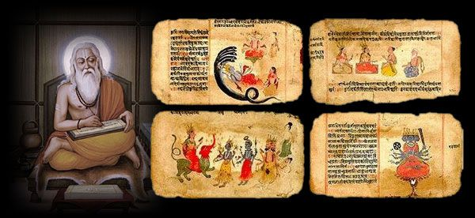

###  वेदको परिचय




यस पुस्तकको शुरुमा वर्णन गरिएका ऋषि अत्रि तथा आत्रेय र त्यस पछि प्रवरका रुपमा आएका तथा अन्यान्य वंशप्रवाहहरु , माथि वर्णित प्राकमानवहरु र यसका प्रजातिहरुलाई कति युगका लय र प्रलयहरुका कसीमा खारिनुप¥यो होला । ईसा पुर्व लगभग ४० लाख वर्षदेखि ईसा पुर्व १० हजार वर्ष सम्म अर्थात मानव उत्पत्ति भएको पुर्णरुप लिनको लागि माथि भनिएको काल खण्डहरुका विभिन्न उथल पुथल र उतार चढावका धारहरुमा खारिदै ऋग्वेदको रचनाकाल (ईशा पुर्व ३५०० देखि ईशा पुर्व १५०० वर्ष) मा व्यवस्थित भएको आर्ष परम्परा अति समृद्धिशाली जीवनशैलीयुक्त मानव समुदायमा परिणत भइसकेको प्रमाणीत हुन्छ । समृद्ध जीवनशैलीका आवश्यक पुर्वाधारहरु निर्माण भइसकेपछि बौद्धिक उचाइतिर गन्तव्य अघि बढ्द छ । यस अवस्था(आर्ष अवस्था)का ऋचाहरुको अध्यनले के कुरा संकेत गर्दछ भने मानवीय सामााजीक जीवन पद्धति अति समद्धशाली भइसकेको थियो अनि उसको प्रयास र गन्तव्य चाहिं बौद्धिक उचाइतिर गवेषणहरु ब्ढिसकेको थियो भन्ने देखाउँछ । अत्रि ऋषिको रुपमा आइपुग्न मान्छेले उपल्लो युगका अनेकौं कालखण्डहरु गुजार्नू परेको थियो । ईशा पुर्वको १० हजार वर्ष पहिलेको जंगलीयुग अनि यस युगका पनि निम्न तीन काखण्डहरु निम्न पुरापाषााण युग , मध्यपुरापाषाण युग अनि उत्तरपाषाण युग र यस पछिको पशुपालन युगहरु पर गर्दा यस धर्तीमा कति उथलपुथल र कयौं उलटपुलटहरु भए होलान् अथाह र अनन्त छ । जीवाष्म अवशेषहरु र अन्य प्रागैतिहासिक सामाग्रीहरुबाट मात्र अनुमान र आंकलन गरिएका छन् । मानव इतिहासले ऋष्किालीन अवस्थामा आइसकेपछि भने श्रुति(कर्ण परम्परा) र हाल वेदको रुपमा रहेको वेद र यसको परिचय सार संक्षेप रुपमा यहाँ प्रस्तुत गर्नु सान्दर्भीक होला भन्ने ठानेको छु ।

धर्म, अर्थ, काम , मोक्षको उपाय जान्ने साधन नै वेद हो१ । यही वेद अम्नाय , आगम , श्रुति भनिन्छ अनि त्रयी भनिनु चाहिं पद्य्मय ऋचाहरु भएको ऋगवद १ , गद्यमय ऋचा भएको यजुर्वेद १ र गीतिमय संरचना सामवेद १ भनेर मुख्य तीनवटै मात्र थिए । पछि अथर्व नामका ऋषिले आचरण र व्यवहार निर्दिष्ट गर्न ऋचा थपेको हुनाले अनि मात्र वेदको संख्या ४ भएको पाइन्छ ।
वेदका मन्त्र र ब्राह्मण गरी दुई रुप छन् । मन्त्र समुदाय नै संहिता हो । ब्राह्मण रुपको भाग चाहिं संहिताको व्यख्या गर्न तीन रुपका छन् ब्राह्मण , आरण्यक र उपनिष्द् । ब्राह्मण भागले यज्ञको रुपबारे प्रतिपादन गर्दछ । आरण्यकले चाहिं जंगलमा गरिने यज्ञको आध्यात्मिक पक्षको प्रतिपादन गर्दछ । उपनिषद्हरु ब्रह्मबोध गने मोक्षका साधन हुन् ।

#### ऋग् वेद


स्तुति गरिने पद्यमय ऋचाहरुको समुह ऋग्वेद हो । यत्रमा यिनै मन्त्रहरुले देवताको स्तुति गरिन्छ । यसका दुई भाग छन् १ सुक्त २ मण्डल ।

सुक्तहरु चर किसिमका छन् । १ ऋषिसुक्त २ देवतासुक्त ३ छन्दसुक्त ४ अर्थसुक्त । एउटै ऋषिले अन्तर्दुष्टिबाट प्रतिपादन गरेका मन्त्रको सुक्त ऋषिसुक्त हो । एउटै देवतासंग सम्बन्घित मन्त्रहरु देवतासुक्त हुन् । समान छन्दका समुह मन्त्रहरु छन्दसुक्त हुन् ।

पुनः ऋग्वेदलाई मण्डानुवाक र अष्टकाध्याय सुक्तका भेदले दुई भागमा बांडेका छन् । वालिखिल्य सुक्तलाई छाडेर ऋग्वेदका संहितामा १० मण्डल ८५ अनुवाक २०८ वर्ग र ८ अष्टक ६४ अध्याय १०१७ सुक्तहरु छन् ।

यसमा सबै मन्त्रहरु १०४६७(कसैले) १०५८० पनि मानेका छन् । शब्द संख्या १५३८२६ अक्षर संख्या ४३२००० छन् । छन्दहरु १४ छन् ।

यस वेदका मन्त्रद्रष्टा ऋषिह्रु ग्ृत्समद , विश्वामित्र , वामदेव , अत्रि , भरद्धज , वशिष्ठ आदि हून् ।यी ऋषिहरु दोश्रो मण्डलदेखि सातौ मण्डलसम्मका मन्त्रद्रष्टा  हुन् । दशौं मण्डलचाहिँ अन्यान्य ऋषिसँग सम्बन्धित छ । दोश्रो देखि सातौ मण्डलका मन्त्रहरुको रचना सबभन्दा पुरानो मानिन्छ ।

#### यजुर्वेद

अध्वर्यु ऋत्विक्ले यज्ञ गर्दा पढिने गद्यमन्त्रहरुको संकलन नै यजुर्वेद हो । यी मन्त्र विना यज्ञ हुनसक्तैन । यजुर्वेद कृष्ण र शुक्ल गरी दुई भागमा बाँडिएको छ । पौराणिक आख्यान अनुसार ऋषि व्यासले वैशम्पायनलाई वेद सिकाए । वैशम्पायनले उनका शिष्य याज्ञवल्क्यलाई सिकाए तर पछि याज्ञवल्क्यदेखि रीस उठेको हुनाले वैशम्पायनले वेद फिर्तागर्नु भनेपछि याज्ञवाल्क्यले तुरुन्त सबै वमन गरिदिए । वैशम्पायनका अन्य शिष्यहरुले तित्तिरी –एक प्रकारको पंक्षी) को रुप लिएर त्यो वमन गरेको वेद खाए । त्यही वमन गरेको चाहिँ कृष्ण्युर्वेद हो ।

वैशमपायन रिसाए पछि याज्ञवाल्क्यले चाहिं पुनः वेद पाउन सुर्य आराधना गरेपछि सुर्यबाट प्राप्त वेद नै शुक्लयजूर्वे हो भनिएको छ । यी दुइमा निकै ठुलो अन्तर छ । शुक्लयजुर्वेदमा विनियोग रहित मन्त्रहरु मात्र छन् तर कृष्णयजुर्वेदमा चाहिं विनियोग , वाक्य र मन्त्रहरु छन् । त्यस कारण अमिश्रित रुपमा शूक्लयजुर्वेद र मिश्रित रुपमा कृष्णयजुर्वेद भनेर पनि भन्ने गरेको पाइन्छ ।

यजुर्वेदमा ४० अध्याय , ३०३ अनुवाक , १९७५ कण्डिका (मन्त्र) २९६२५ शब्दहरु ८८८७५ अक्षरहरु छन् । यसका प्रत्येक अध्यायहरुमा विभिन्न प्रकारका यज्ञहरुको गर्ने विधानको निरुपण छ ।

शुक्लयजुर्वेको वाजसनेयी संहिता नामाकरण हुनमा चाहिं एक आख्यान छ । जब याज्ञवल्क्यले वेद जान्न सुर्यको तपस्या गरे , सुर्य पनि बाजी(चरो ) भएर यिनलाई वेद सिकाएको हुनाले यो संहिताको नाम बाजसनेयी भएको भन्ने पाइन्छ ।

शुक्लयजुर्वेदका माध्यन्दिनीय शाखा र कण्व शाखा गरी दुई शाखा छन् । पहिलो उत्तर भारत र नेपालतिर प्रचलित छ भने दोश्रो चाहिं महाराष्ट्रमा प्रचलित छ ।

कृष्णयजुर्वेका भने चार शाखाहरु छन्।

```
१. तैत्तिरीय शाखा: यो शाखा मुख्य हो । यहाँ सात खण्डहरु छन । ती खण्डहरुलाई अष्टक र काण्ड पनि भनिन्छ।
२. मैत्रायण्ी संहिता
३. काठक संहिता
यी दुवै संहिताहरु तैत्तिरीय संहिता जस्तै छन् ।
४. कठकापिष्टल संहिता

```
यसको आधा भाग मात्र पाइन्छ ।


#### साम वेद

यज्ञमा चार ऋत्विक्हरु रहन्छन् । होता , उद्गाता, अध्वर्यु र ब्रह्मा । होता भन्नाले देवताहरुलाई आहवान गर्ने (बोलाउने) हो । स्तुतिका लागि प्रयाग हुने मन्त्रहरु ऋक् भनिन्छ । त्यस्ता मन्त्रको संकलन ऋग्वेद हो भनिसकिएको छ ।अध्वर्यु यज्ञ गर्दछ । त्यसको लागी संकलित मन्त्र यजुर्वेद हो । ब्रहमा चाहि यज्ञ निरीक्षण गर्ने सबै व्यबहार निपुण व्यक्ति हो र उसले प्रयाग गरिने मन्त्र समुह नै अथर्व वेद हो । उद्गाताले चाहिं उच्चस्वरले सप्तस्वर र लयबद्धगरी मन्त्रहरु गाउँछ र तिनै गाइने मन्त्रहरुको संकलन नै सामवेद हो । यसमा १५४९ मन्त्रहरु छन् । ती मध्ये ७५ मन्त्रहरु ऋगवेदमा पाइदैनन् भने अरु मन्त्रहरु सामवेदमा पनि छन् । तर यी मन्त्रहरु सप्त स्वरमा गाइन्छन् ।
समवेदका दुई भाग छन् ।

- क. पुर्वार्चिक छन्द, छन्दसी भनिने यस भागमा पुनः चार भाग छन् । ती हुन १ आग्नेय पर्व २ एन्द्र पर्व ३ पवमान पर्व ४आरण्यक पर्व

- ख. उत्तरार्चिकमा चाहिं अनुष्ठान अनुसार धेरै  बिभाग छन् । दशरात्र , संवत्सर , ऐकाह , सत्र , प्रायश्चित्त , क्षुद्र आदि प्रमुख हुन् ।


#### अर्थवे वेद

अथर्व नाम गरेका ऋषिले व्यवहारिक आचारयाहरुको निरुपणका लागि प्रतिपादन गरेका मन्त्रहरुको समूलायई नै अथर्ववेद भनिन्छ । यसमा २० काण्ड, ७३१ सुक्त, ५९८७ मन्त्रहरु छन् ।यी मध्ये १२०० मन्त्रहरु ऋग्वेदमा पनि पाईन्छ । वीसौं काण्डमा १४३ सुक्तहरु छन् । ती मध्ये १२ सुक्तहरु बहेक सबै सुक्तहरु ऋग्वेदको दशौं मण्डलमा पाइन्छन् ।
यस वेदका नौ शाखाहरु थिए तर हाल शौनक र पिप्पलाद दुई शाखा मात्र पाइन्छन् ।
वेदका रचना काल
वेदको रचनाकालका सम्बन्धमा धेरै मत मतान्तरहरु पाइन्छन् । जर्मन विद्धान मेक्स्म्ुलरले यसको रचनाकाल ईशा पुर्व ११५० तिर हुनुपर्दछ भनेर विभिन्न प्रमाणहरु अघि सारेका छन् ।
डा. अविनाश चन्द्र दासले वेदको रचना आज भन्दा २५ हजार वर्ष अघि भएको प्रमाण पेश गरेका छन् ।
ज्योतिर्विद्हरुको मतमा वेदका ऋचामा वर्णित समयको परिगणना गर्दा याको रचना ई.पु. २,५०० हुनु पर्ने वताएका छन् ।
बलगंगाधर तिलकले वेदमा वणिर्त मन्त्रहरुका अथको हिसावमा पृथ्वीको परिभ्रमणको गणनाको आधारमा  ई.पु. २,००० भएको हुनु पर्ने तर्क दिएका छन् ।
