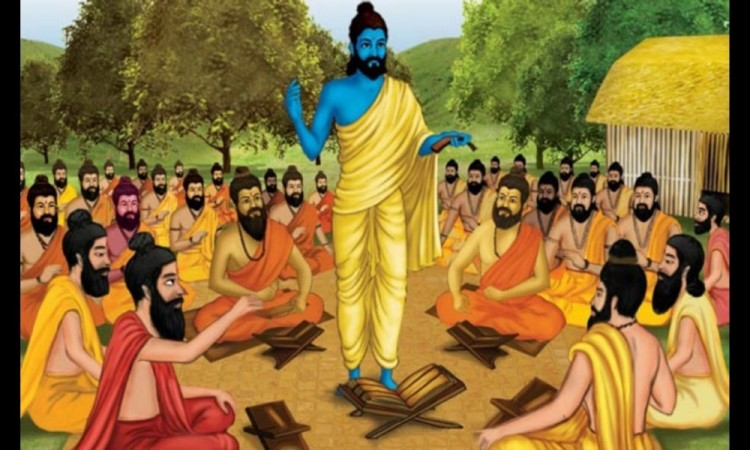

###  वंश इतिहास





मानव इतिहासले विभिन्न लय प्रलयका युग , युगान्तर पार गरेर ऋषिकालीन समयमा आइपुग्दा जीवनशैलीका उच्चतम विन्दुहरुलाई पहिल्याइसकेको थियो । त्यस समय र परवर्ती समयहरुमा जविनका रहस्यमय प्रकरणहरुको खोजवनि साथै उच्च आचरण र आदर्श जविनबोघ गरिसकेको थियो  भन्ने प्रमाण बेदमा वर्णित सुक्त तथा मन्त्रहरुले बताउँछन् । यस अवस्थामा उल्लेखहुन पुगेका हाम्रा कुलपुरुष अत्रिको वंशसुत्र पनि यस खघिका पुर्वजहरुको श्रृखलाको एक कोसेढुंगो हुन पुगेको हो । तत्कालीन आख्यानको एक माटोले ब्रहमाजी हूदै नारायणमा पु¥याएर स्रोतको टुंग्याउने एक परिपाटि वा पद्धति मात्र हो । शाश्त सत्य भने नृवंशका प्रवाहका रुपमा बग्दै आएको जीव जीवात्के एक विन्दु ऋषि अत्रि पनि हुन् । त्यसैले अलौकिक प्रतिभाका धनी, सारा वौद्धिक बाङ्मयका स्रष्टा पहर्षि व्यास ले पनि माानव गुह्य र अत्यन्त उच्च अमुल्य खजाना हो भनेर मानवको सर्बश्रेष्ठता लाई स्वीकारे रै मात्र सन्तोषको सास फेरे । 

वर्तमान हाम्रो मुलुकमा पाइने मानव समुदायहरुको रुपरगं शारिरिक बनावट मध्ये आँखा नाक र भाषागत विभिन्नतालाई पर्गेल्दा पुर्वजहरपनि विभिन्न आनुवशिक आदिमानवहरु भएकोेमा दुई मत छैन । रंगरुप, आकार र बनावटले मुलतः ४ खलक भन्ने स्पष्टै छ । रंगकै हिसाव छुट्याउनसम्म सकिने किसिमले छुट्याउनु पर्दा पीठो जत्तिकै सेतादेखि लिएर अति काला (हांडीको पधि ) सम्मलाई वर्गीकरण गर्दा ३६ खालेमा मात्र छुट्याउन सकिन्छ ।यसै कारणले पृथ्वीनारायण शाहले ४ जात र ३६ वर्ण भनेर वर्गीकरण गरकाहुन्ख कि भनेर अनुमान गर्न सकिन्छ । यी ४ अग्नेली वा इतर आर्य ठेटने कल्स्याउँदामा वर्गीकरण गर्न सकिन्छ । चारै जातजाति र ३६ सै वर्णहरु मिलेर बसेको साझा फुलवारी नेपाल हो । प्रारम्भतिर यस पुलुकमा उक्त चारखाले आनुवंशिक पुर्वजहरु विभिन्न समयहरुमा विभिन्न कोणहरुतिरबाट आएर बसोबास गरेको कुरा इतिहासले खुट्टयाएकै छ । द्रविडजातिका खलक मानिने झाँगडहरुदक्षिणतिरबाट अनि अग्नेली जातिका खलक मानिने सतार सन्थालहरु पुर्व दक्षिणतिरबाट र मंगोल जातिका खलक मानिने पहेंला  जाति राईलम्बुहरु पुर्वोत्तर कोणतिरबाट र आर्य जातिका खलक मानिने ब्रह्मण , क्षेत्री शकहरु दक्षिण पश्चिमकोणबाट विभिन्न समयहरुमा यस मुलुकको धर्तीका भित्रिएर बसोबास गरेको इतिहासले सिद्ध गरेको छ । कुन जाति कुन समयमा भित्रिएको भनेर समयको अन्तरालको परिगणनाको अवधि मात्र फवरक देखिन्छ । 

यसै क्रममा हामी आत्रेय गोत्री आर्यका सन्तानका पुर्वजहरु त्यस वेलाको मालवेदेशका धारानगरीमा(कन्नौज) बसोबास गर्दै गरेको पाइन्छ । आज यसरी भौगोलिक सीमांकन व्यवस्थित गरिएको छ त्यसरी त्यस ताका सीमांकन थिएन र भइहाले पनि ज्यादै चलायमान भइरहन्थ्यो । बलियो राज्यले कहिले सीमा कून नेटो कायम गर्दथ्यो भने दुर्बल भएको अवस्थामा त्यो सीमा कति सरिसकेको हुन्थ्यो भन्ने प्रमाण किल्ला काँगडहरुले पनि पुष्टि गरेको छ । अति फराकिलो धर्ती अगम्य र सीमाविहिन अवस्थामा थियो । त्यस कारण आज निर्धारण गरिएको सीमाका आधारमा त्यति खेरको बसोबासलाई बाहिर वा भित्रको भन्नु आकाशमा काल्पनिक सीमारेखा कोर्नु जत्तिकै हास्यास्पद हुन जान्छ । वर्तमान मात्र जनधनत्व बढेको र मानव समुदाय व्यवस्थित गर्न जमीन तथा आकाशमा समेत सीमा रेखा कोरिएका छन् 

 विक्रमादित्यको उदयतिर जीवन शैली समद्ध र व्यवस्थित मात्र थिएन उन्नत बौद्धिक खुराकको रुपमा साहितयको पनि सिर्जीना चरम रुपमा हुदै थियो । यता सामान्य जनमानसमा तीनवटा पक्षले ज्यादै गहिरो जडा गाडेको पाइन्छ । त्यो पक्ष हो ज्ञान , उपासना र कर्मकाण्ड । यी तीनै कुरामा युगान्तकारी अन्बेषणहरु भइसकेको पाइन्छ । ज्ञानको पीपासा सेट्न विभिन्न उपपनिषद्हरु ब्राह्मणग्रन्थहरु र विभिन्न नौ दर्शनहरु प्रतिपादन हूदै थिए भने उपासना पक्षलाई समेट्न रामायण , महाभारत र त्यस पछिका कवि कालिदास आदिका उत्कृष्ट कृतिहरुको रचनाहरु गतिलो बैद्धिक खुराकाको रुपमा प्रयाग भएको पाइन्छ । त्यसैगरी कर्मकाण्ड तर्फ थरिथरिका यज्ञ यज्ञादिहरुको प्राचुर्यताले गर्दा मानव मुल्यको दया , उपकार , दान , परसेवा आदि उत्कृष्ट सामाजिक आचरण व्यवस्थित भएको पाइन्छ । यस्ता यज्ञहरु सम्पादन गर्न र गराउन दक्ष , चतुर र संमर्थवान् व्यक्तिको आवश्यकता पर्ने हुँदा यस व्यवहारमा कुशल व्यक्तिहरुलाई यज्ञको प्रतिरक्ष ागर्न , ध्वंस गर्नबाट वचाउन प्रतिहारीहरुको पनि व्यवस्था भएको पाइन्छ । पछि गएर प्रतिहारीहरुले एक व्यवसायिक कुल  कै रुप लिन पुगेको देखिन्छ । यस्तै प्रतिहारी वंशमा आत्रेय गोत्री रंगनाभ ब्रह्मण (वि.स. ६५०) गंगाजीको किनार हरिद्धारमा बस्तथे भन्ने स्रोत पाइन्छ । कसै कसैले यिनलाई प्रसिद्ध सोमनाथको मन्दिर निमार्ण गर्ने सोमनाथका छोरा हुन् पनि भनेका छन् । विभिन्न संकलनबाट त्यस पछि वंशानुगत नाम नामावली क्रमश ः तल दिइएको छ ।  

- रंगनाथक (वि.स. ६५०)
- पुरनाभ
- ब्रह्मनाभ्
- प्रसरनाभ
- भीमदेव
- पुर्णदव
- देवदेव
- शक्तिभट्ट( भद्रबाट अपभ्रंश भट्ट)
- पृथ्वी भट्ट
- कुवेर भट्ट


#### उदयभट्ट


कुबेर भट्टका तीन भाइ छोरा मध्येका उदयभट्ट कान्छा हुन् । यिनी आत्रेय गात्री ब्रााह्मणहरु पौड्यल , सिग्देल , अर्याल , दुलाल र तिनका क्ष्ोत्रीहरु एंव समाल समुहका ठकुरी र बगाले थापा खलकका आत्रेयगोत्री ठकुरी क्षेत्रीहरुको समेतका कुलपुरुष मानिन्छन् । यिनी धार्मिक प्रकृतिकाहुनाले एक हातमा संधै कुशको पवित्र धारण गरेर हिड्ने हुनाले मान्छेहरु कुशवन्नख भट्ट वा कुश भट्ट भनेर सम्बोधन गर्दथे । यिनको जन्म वि.स.१०९१ तिर भएको अनुमान इतिहासविद्हरुले गरेका छन् । यिनले बाल्यवस्थामै विद्याको खानी भानिएको काशीमा गएर पर्याप्त विद्या अध्ययन गरि घर फर्केपछि उमादेवी सँग विवाह गरे । श्रौत , स्मार्त कर्मनिष्णात यिनी विद्धान् मात्र थिएनन् अति प्रभावशाली पनि थिए । त्यसताका हिन्दुधर्म र संस्कृतिमाथि चारैतिरबाट पर्न गएको आक्रमण र अतिक्रमणका कारण यिनलाई के गरौ कसो गरौको उकुस मुकुस भइरहको बेला चतुर पत्नीले दुवै पतिपत्नी उत्तराखण्डको पवित्र तीर्थस्थल मानसरोवर स्नान गर्न जाने प्रस्ताव राखिन्। उनलाई पत्नीको यो प्रस्ताव घतलाग्दो लाग्यो । दुवै दम्पती बाटाका पहाडी दृश्यहरुको अवलोकन गर्दै मानसरोवरसम्म पुगे । त्यहाँको प्राकृतिक छटाहरुको दृश्यपानगर्दा र आनन्दपुर्वक तलाऊमा स्नान गर्दा दुवै पतिपत्नीलाई शीतल शारीरिक अभुतपुर्व बडो आनन्द र मानसिक रुपमा समेत कायाकल्प भएको महसुस भएछ । अब यी दुवै दम्पती उत्तरखण्डको देवभुमि , गुफा, कन्दराहरुमा तपस्या तथा याग साधना गरेर ब्रह्मचिन्तनमा बांकी जीवन व्यतित गर्ने कल्पना गर्दै गर्दै फर्कने क्रममा एकदिन अलकानन्दाको पवित्र सुरम्य किनारमा अवस्थीत सुन्र बस्तीमा वास बस्न पुगेछन् ।

पहाडी भेकका अति सरल स्वभाव भएका मानिसहरु वसोबास गरेको त्यस वस्तीमा कस्तो रोचक परम्परा रहेछ भने बस्तीभरि कसैको घरमा नवआगन्तुक अतिथि आउँदा ‘अतिथि देवो भव’ भनेझै छर छिमेकीका पनि मन्छहरु भेला भएर अतिथिहरुको सेवा सुश्रुषा गर्ने तथा भलाकुसारी र सत्संग गर्ने प्रायः प्रोढ व्यक्तिहरु कर्तव्य सम्झिइदोरहेछ । त्यहाँ बस्ने क्रममा उदयभट्टले आफ्नो परिचय दिंदा आफु कान्यकुब्जी शुक्लयजुर्वेद मान्ध्यान्दिनीय शाखाध्यायी विवाहित आत्रेयगोत्री भट्ट ब्राह्मण भनेर परिचय दिएछन् । कान्यकब्जी ब्रह्मणहरु अव्वल दर्जाका पवित्र ब्राह्मण मानिन्थो । पाहना सपत्निक उदयभट्टलाई त्यहाँका पाका प्रौढहरुले विशेष श्रद्धापुर्वक भोजन गराइसकेपछि बेल्का प्राय ः बस्तीभरका प्रौढहरुको जमघट भएछ । त्यस सत्संगमा उदयभट्टको व्यक्तित्व, ज्ञान र शास्त्रीय पूवचनको प्रभावपुर्ण छाप त्यहाँ प्रौढहरुमा परेछ । उनका ज्ञान तथा तार्किक वचनामृतको प्रभावले सबैले उनको मुक्त कण्ठले प्रशंसा गरेछन् ।

त्यसताका दक्षिणतिरबाट कतिपय चाटुकार र बञ्चकहरुले त्यहाँका सोझा सीधा मानिसलाई ठगेर झुक्याएर दुःख दिएर अनभव पनि उदयानन्दको , वस्तुभाउ र यदाकदा त्यहाँका छोरी बेटीकोे इज्जत लुटिने गरेका कटु अनुभव पनि त्यहाँ व्यक्त भयो । त्यस अवस्थामा यी पाहुना बलशाली र व्यक्तित्वशाली हुनाले अभिभावक हुुन सक्ने सोचेर त्यहाँका बासिन्दाहरुले सपत्निक उनलाई त्यही बस्तीमा वस्ने आग्रहको प्रस्ताव राखे । उदय भट्टले पनि आखा चिम्लिएर केही बेर ध्यान मग्न भएर सोचेछन् । त्यस भेकका सरल तथा सह्दयी व्यक्तिहरुको आग्रह तथा आफू पनि त्यस्तै पत्रि देवभुमितुल्य ब्रह्मस्थालमा एकान्तचिन्तन र याग साधनाद्धारा ब्रह्मचिन्तनमा रहने ¥याङमा ठ्याङ दुवैको विचार ठिक्क मिलेछ । उदयभट्टले त्यस बस्तीमा रहन स्वीकार गरे । उनको अभिलाष बमाृजिम दुई दिनपछ उनको तीर्थागमन समाप्तिको अनुष्ठानको लागी सारा बस्तीकै विशेष सक्रियता र उत्साहका साथ भव्य तीर्थेभोजको आयोजना भएछ । त्यस अनुष्ठानमा त्यहाँ र वरपर समेतका योगी , तपस्वी , साधम , प्रतिष्ठित सवैका उचित सम्मानका साथद भण्डारा भएछ । त्यस वेलादेखि त्यस ग्राममा उनी ग्राम प्रमुख अभिभावकको रुपमा सपत्निक प्रतिष्ठित जीवन यापन गर्नथाले । बस्तीमा पनि आवश्यक सुधारहरु गराए । 

बस्तीको नै श्रीवृद्धि भएको कारणले त्यस बस्तीको नाम श्रीनगर नामाकरण गरियो । उदय भट्टलाई त्यस भेकका मान्छेहरुले ‘भट्ट महोत्तम’ भनेर सम्मान गर्न थाले । उनि त्यस ठाउँमा प्रमुख मात्र भएनन् उनले गर्ने दिनचर्या अति आदर्शं र अनुकरणीय रह्यो । उनी बिहानै नदी स्नान गर्थे । बलीवैश्व, गोपुजन, देवपितृतर्पण र गाग्रास गरी अतिथिलाई भोजन गराएर मात्र आफु भाजन गर्थे । त्यहाँ उनले ग्राम प्रमुखले गर्ने कर्तव्य र धर्माधिकारीले गर्ने कर्तव्य समेत गरेर आदर्श जविन निर्वाह गरे । रहँदाबस्दा पत्नी उमादेवीबाट एक पुत्रको जन्म भयो जसको नाम सुदयभट्ट(सदु भट्ट(मायाले बोलाउदाँ) थियो । उदयभट्ट सँधै बिहान ब्राह्मण बुटहरु भेला गरेर वेद अध्ययन गराउँथे ।

#### सुदय भट्ट

यिनकी पत्नीको नाम भुमादेवी थियो । पिताले गर्दै आएको वेद अध्यापनलाई  यिनले अझ व्यवस्थित गरे । यिनका छोराको राजभट्ट थियो । जनसाधारणले .चाहिँ रायभट्ट वा राईभट्ट भन्ने गर्थे ।

#### राईभट्ट(राजभट्ट)

यिनकी पत्नीको नाम रमादेवी थियो । यिनले काशी गएर विद्या अध्ययन गरेका थिए । यिनको  छोराको देवदत्तभट्ट थियो ।

#### देवदत्तभट्ट

यिनले पनि काशी गएर व्याकरणको अध्ययन गरेका थिए । अध्ययन पश्चात् आफ्नै गाँउमा फर्की देवप्रया भन्ने बहम्ण कन्यासँग विवाह गरे जस्माट वत्सराज पुत्र पैदा भए ।

#### वत्सराज भट्ट

वत्सराजभट्ट त्यस अवस्थाका ख्यतिप्राप्त विद्धान मात्र थिएनन् , निपुण प्रशाासक पनि भए । उदयभट्टबाट प्रतिस्थापित श्रीनगरको ग्राम प्रमुखको रुपले यिनका पालासम्म एउटा राज्य प्रमुखको रुप लिइसकेको थियो । त्यस कारण उनी त्यहाँ राज्य प्रमूखको रुपमा राज्य संचालन गर्न चाहन्थे । शास्त्रीय उपदेश अनुरुप (स्वराज्य कामो वाजपेयेन यजेत) अर्थात राज्य चाहनेले वाजयेय नामको यज्ञ गर्नुपर्छ भन्ने उक्तिबाट उनले त्यहाँ बाजपय नाउका ठुलो यज्ञ सम्पनन् गरे । त्यस क्षेत्रमै अभुतपुर्व यस्तो यज्ञमा लौह समीधा जाएर चमत्कारिक कार्यहरु गरेको हुनाले वत्सराज  भट्टाचार्य बाजपेयी पनि भनिन थाल्यो । यिनैका एक खाले गोत्रापत्यहरु हल भारतका ‘बाजपेयीहरु ’ हुन भनिन्छ । ब्राहमण कन्या पत्नी वसुन्धरातिर सन्तान भएनन् । कन्नौज गएर ब्राहमण कन्या पुनः विवाह गर्न खोज्दा यिनलाई कन्या दिएनन् । राजपुत राजा माधवसिंहकी छोरी शुभकन्यालाई विवाह गरी ल्याए । तिनबाट ‘कालुथापा’ जन्मेछन् । ससुरा माधवसिहंको राज्य र शासनभार समेत यिनलाई सुम्पेको हुनाले उनी त्यस क्षेत्रको पनि राजा भएर शासन गर्न थाले । पत्जी शुभकन्यालाई भने आफ्ना ब्राह्रमण पतिका सन्तान क्ष्ोत्रीहरु मात्र हुने र तिनले पितृहरुलाई पिण्ड दिदाँ पीठोको पिण्ड बनाई दिनपर्ने प्रचलन समेतले उनलाई ज्यादै पिर परेको थियो । आप्mना मितबा(माधवसिंहका ब्राह्मण मीत ) संग आफ्ना पतिलाई उनकी छोरी आग्रह गरेकी हुनाले तिनै ब्राह्मणीतिरबाट उपवत्सराजके जन्म भयो । यसरी आफ्नो वंश परम्परामा ब्राहम्ण तथा क्ष्ोत्री परम्परा दुवै श्रृंखला बढेको पाइन्छ ।


#### उपवतसराज

यिनी वत्सराजका ब्राह्मणी पत्नी तिरका छोरा हुन् । यिनले सुवेदी थरका ब्राह्मण कन्यासँग विवाह गरे । वि.स. १३ औं शताब्दीतिर भारतैभरि मुसलमानहरुको दवदवा बढिरहेको थियो । हिन्दु बस्ती भएको श्रीनगर र गढवालतिर झनै आक्रमणको विगविगी चरम अवस्थामा भइरहेको थियो । हिन्दुधर्म र संस्कृतिलाई वचाई राख्न त्यस अवस्थामा हिन्दुहरुमा कोटीकोटी पर्न  थाल्यो । अझ शासनभार समेत संचालन गरेर रहेका हिन्दुहरुमाथि त मुसलमानको आक्रमणझन् तीब्र हुने नै भयो । त्यस अवस्थामा माथि वर्णित सौतिनी आमा पट्टिका कालुथापालाई राजपाट सुािपएर ब्राह्मणीपुत्र यिनी आफ्ना परिवार सति पहाडका कन्दरा गुफहरुमा आश्रय लिदै आफ्नो बासस्थान छाडेर हिमाली भेक तिर बढेका हुन् भनेर इतिहासविद्हरुले बताएका छन् । यिनी वि.सं १२५० तिर र्वतमान नेपालको सीमाभित्र पसेको विद्धानहरुको अनुमान छ ।

कालुथापाका चार भाइ छोराहरु मध्ये माहिलाका सन्तान(टीकमगढ) भारतमा बसेको हुनाले ताममेली र कान्छाका सन्तान जुम्लामा आई बसेको हुनाले जु्म्लेली थापा भएका हुन् भनिएको छ । थापाको वंशावलीमा कालुथापाको समय वि. स. १२४६ भन्ने उल्लेख गरिएको छ । राज्य संचालन गरेर बसेका कालुथापा समेत त्यस ठाउँमा टिक्न नसकी उपवत्सराजलाई पछ्याउदै पहाडतर्फकारमाइला बस्तीहरु चहदै उक्त क्षेत्रको उत्तर तर्फको वस्तीमा वस्ने गरेको देखिन्छ । त्यहाँ पनि कालुथापाका खलकलाई राजा र उपवत्सराजका खलकलाई राजगुरु पदवी दिएको पाइन्छ । राजालाइृ राज्य र राजगुरुलाई विर्ता दिने प्रचलन पनि साथै रहेको पाइन्छ । उपवत्सराजका छोरा श्रीवत्सराज थिए ।

#### श्रीवत्सराज

यिनी चारै वेद पढेका निकै विद्धान थिए । आफ्ना पितामाहका पालामा जमेको राज्यसत्ताको इतिहास कर्ण परम्पराबाट थाहा पाएपछि आपm्ना पुर्वजहरु राजा भएको र पुनः त्यस ठाँउमा पनि आफ्नै कुलका सन्तानहरु राजा रहेको अवस्थामा राज्यसंचालनको अवसरलाई दरिलो बनाउन धार्मिक आस्था अन्ुसार वाजपेय यज्ञ गर्ने धोको पुरा गर्न यिनले ठुलो यज्ञको आयोजना गरे। बजपेय यज्ञमा आफु हर्ताकर्ताको रुपमा रहँदा ‘बाजपेयी भट्टाचार्य’ पदले उनलाई सम्बोधन गर्न थालियो । यिनले यज्ञमा लौह समिधा जलाउन भारद्धाज गोत्री एक ब्राह्मणलाई यज्ञमा दीक्षित गरी लगाएका हुनाले यिनै ब्रह्मण कन्या धर्मशिलपट्टी जेठा श्रीकृष्ण तथा कान्छा श्रीदेव छोराहरु भए । अर्की जुम्लाकी राजकुमारीपट्टिबाट चाहिं आत्रेय गोत्री समाल ठाकुरीहरुको गोत्रापत्य वंश परम्परा चलेको हो भनिन्छ । त्यसवेलाको चलन अनुसार क्षेत्री ठकुरीहरुलाई राज्य , ब्राह्मणहरुलाई राजगुरु पद र विर्ता समेत दिने परम्परा अनुसार जेठा छोरा श्रीकृष्णलाई सिग्दी क्षेत्र र कान्छा छोरा श्रीदेवलाई पौडी गाउँ विर्ता दिइएको हुनाले श्रीकृष्णका सन्तान सिग्दीश्रआलय सिग्द्यालयश्रसिग्द्याल श्र सिग्देलर श्रीदेवका सन्तान पौडीश्र आलय। पौडयालश्र पौडेल भएको पाईन्छ ।

श्रीवत्सराजका पत्नीहरुको नामका बारेमा पनि विवाद नभएको होइन । राजकन्या पट्टिका सन्तान समाल ठकुरीहरु हाल पर्वतको गल्कोट आदिका मल्ल र अछामी जाजरकोटे सल्यानी शाहहरु यिनै आत्रेय गोत्त िसमालहरु हुन् भनेर रामजी अर्यालले औल्याएका छन् ।

ब्राह्मण पुत्री धर्मशीलका कान्छा छोरा श्रीदेव र तिनका छोरा श्रीनन्द(श्रीनाद) भट्टहरु पछि पौड्याल कहलाइए । तिनका छोरा श्रीराम र हरिराम थिए । श्रीरामका छोरा हरिदत्त र यिनका पनि छोरा श्रीकृष्णराम थिए । श्रीकृष्णराम थिए । श्रीकृष्णरामका चाहिं सदु र च्यवनराज (चावा) थिए । यी चावा वा च्यवनराज हालको गुल्मी जिल्लाको ईस्मामा आई राजा भए भनिन्छ । पछि गुल्मीका राजपुत्र –मकवानी वंशका ठकुरी ) लाई ल्याई राजा तुल्याएर आफु र आपm्ना सन्तानहरुलाई चाहिं राजगुरु भई बसेछन् । यिनै चावाकी जठी पत्नी अज्र्यै वा अर्जीमा बसेको हुनाले यिनैका सन्तान अर्जी श्र आलय । अज्र्यालय श्र अर्याल वा अर्जेल भएको हुन् ।

श्रीवत्सराज (वच्छ) का छोरा तथा पत्जीहरुका नाममा विवाद भने छ । तथ्य चाहिं खोज्ने जिम्मा अनुसन्धानकर्ताहरुमा छोड्नु पर्ला । श्रीकृृष्ण पछिका वंंश श्रृंखलाको स्रोत भने यस पंक्तिकारले अन्य कुनै प्राप्त गर्न सकेको छैन । मात्र योगी नरहरिकनाथज्युको इतिहास प्रकाशमा सन्धीपत्र भाग १ मा ( दिगोगडी गाउँ बस्ने दयाराम पौडयालबाट प्राप्त) बाट उद्धत अंशलाई प्रमुख  आधार मानिएको छ । उक्त स्रोत बाहेक  अन्य कुनै भरपर्दे स्रोत पछि फेला परे वा विद्धत् वर्गबाट उपलक्ध भए पछिका संस्करणमा सच्याई प्रस्तुत गरिने छ । योगी नरहरीनाथज्युले संकलन गर्नु भएको उक्त स्रोतको तत्कालीन भाषिक प्रयागलाई समेत निकै कसरत गरेर मंथन गर्दा बंश तन्तु फेला पार्न सकिएको हो ।
 
उदयभट्ट र अझ उँभोको खोजीकोे बारेमा डा. विष्णूराज आत्रेयज्युले आफ्नो लेख ‘अर्याल वंशको विकास र विस्तारको संक्षिप्त इतिहास ’ मा निम्न खोज अनुसन्धान र नामावली समेत दिनु भएको छ । मनन र तुलनात्मक विश्लेषणका लागी उपयुक्त भएको हुनाले वहाँको वयान र नाम नामेसीहरुलाई सार संक्षेप रुपमा दिन सान्दर्भिक ठानेको छु ।

‘‘ उदयभट्टका पुर्वज प्रतिहार वंशी गौर्जरभट्ट हुन् । यिनीहरु वह्मण भएर पनि क्षेत्रीयोचित राजकाज गर्दथे । यज्ञको रक्षा गर्ने  हुनाले प्रतिहारी भनिएको हो । यी प्रतिहारीहरु पश्चिमतिरबाट भारत पसेकाहुन् भनेर मान्ने पश्चिमेली विद्धान्हरुमा क्रमवेल , ज्याक्सन क्रक, कर्नेलदागं र यिनका पुर्वेली अनुयायीहरु भण्डारकार , त्रिपाठी आदि विद्धान्हरुले भने यिनीहरुको मत खण्डन गरेर यी प्रतिहारीहरु आप्रबासी नभएर प्राचीन आर्यवंशीहरु हुन् भन्ने मत अघिसार्ने पुर्वेली विद्धान्हरुमा गौरीशंकर हीराचन्द ओझा , धीरेन्द्र गांगुली , दशरथ शर्मा , कृष्णस्वामी अयांगार प्रभुति हुन् । यिनै  प्रतिहारीहरु तैत्तरीय उपनिषद्मा वर्णित विप्र वा विप्रनन्दन हुन् भनेको छन् । यिनले यज्ञको रक्षा मात्र गरेनन् अपितु नागभट्टदेखि यशपालभट्ट सम्मका पुरुषहरुले गुर्जरदेखि कान्यकुब्ज सम्मको राज्य शासन समेत गरे ।

#### नगभट्ट प्रथम

यिनी गुर्जर देशका प्रतापी राजा थिए । यिनको शासनकाल वि.सं ८औं शताब्दी थियो । यिनले सिन्धु देशका मुसलमानमाथी आक्रमण गरी जोधपुर गरी जोधपुर छेउको भिननमाल स्थानलाई राजधानी बनाएका थिए । स्कन्द पुराणमा वर्णित । श्रीमाल वा माालपत्रनम् यही भिन्नमाल हो । यस वेल यज्ञको रक्षा गर्नु हिन्दुहरुको प्रमुख कर्तव्य हुनाले यिनै ब्राह्मण नरेशबाट यज्ञको रक्षा भएकोले प्रतिहार वंशी भट्ट भन्ने प्रचलन रह्यो ।

#### देवराजभट्ट

नागभट्ट प्रथम पछि यिनका भाइका छोरा देवराजभट्ट राजा भए । यिनका छोरा वत्सराजभट्ट थिए ।
वत्सराजभट्ट देवराज पछि यिनी राजा भए । यिनले पालवंशी राजा धर्मपाललाई हराए । यिनको मृत्यृ वि. सं ८५१ म भयो ।
नागभट्ट द्धितीय
यिनलाई स्थानीय भाषामा नाहाडदेव पनि भन्दथे । यिनले आफ्नो राज्यको सीमाना कान्यकुब्जसम्म फैलाए । सुन्दर नगरी कान्यकुब्जलाई नै राजधानी बनाए ।

#### रामभद्र

यिनका पालादेखि सारा राज्यको नाम कान्यकुब्ज भयो ।

#### मीहीरभोज

राम भद्र पछि यिनी कान्यकुब्जका राजा भए । प्रतिहारी वंशमा यिनी निकै प्रभावशाली भए । अतः जनता यिनलाई आदिवराह भनेर सम्बोधन गर्थे । कान्यकुब्जमा यिनले ५५ वर्षसम्म शासन गरे ।

#### निर्भयराजभट्ट

मीहीरभोज पछि यिनी राजा भए । यिनी स्वयं पनि विद्धान् थिए । दक्षिणतिरबाट आएका कवि राजशेखरलाई दरवारिया पण्डित बनाएर उनबाट धेरै विद्या यिनले सिके । बालरामायण लेख्ने यिनै राजशेखर हुन् ।

#### महिपालभट्ट

यिनी निर्भय राजको छोरा थिए । यिनका छोरा देवमालभट्ट थिए ।

#### देवपालभट्ट

यिनले कान्यकुब्जमा शासन गर्दा मुसलमानहरुले नराम्रो सित आँखा गाडेका थिए । यिनको मृत्यृ वि. सं १००५  मा भयो ।  

#### नयपालभट्ट

यिनको राज्यकालमा मुसलमान गजनीले कान्यकुब्जमा आक्रमण गरे । ज्यान जोगाउन गाह्रो पर्दा यिनले मुसालमानको कहर(दास) बन्न गरेको स्वीकार छिमेकी सामन्तहरुलाई सह्य भएन । कालिञ्जरका राजा विद्याधरले नयपालको हत्या गरे ।

#### त्रिलोचनपाल भट्ट

नयपाल पछि यिनी सामन्तको रुपाम रहे ।

#### यशपालभट्ट

यिनी त्रिलोचनपालका छोरा थिए । यिनको पानामा पहिले आर्जन गरेको विशाल कान्यकुब्ज क्रमशःटुक्रिदै गयो । यिनको मृत्यृ वि.सं १०९३ मा भए पछि ३०० वर्ष पुरानो वंशको शासन सत्ताको अन्त्य भयो । यस पछि भट्ट ब्राह्मणहरुको राज्य सत्ता गुमेपनि  धर्मसत्ता बाचइ राख्न निकै सचेत हुनुप¥यो । यसै क्रममा स्वधर्म रक्षा खातिर धर्म तथा संस्कृतिको गढ मानिने काशीमा गएर धार्मिक बलले परिपुर्ण भएको छोरा उदयभट्ट पत्नी सहित मानसरोवरतिर प्रस्थान गरे । डा. आत्रेयको बयानमा पनि मानसरोवर स्नान गरेदेखि कायकल्प भएको तथा उत्तराखण्डतिर योग साधना गरेर रहने इच्छा भएको आदि बयान माथि उदयभट्ट प्रसंगसंग हुबहु मिल्दछ । त्यसपछि उनी अलकानन्दाका किनारको बस्ती श्रीनगरमा सपत्निक प्रतिष्ठापुर्ण जीवन यापन गरेको र वंशलता वणृनमा पनि तलदिएसम्म क्रम मिल्छ ।

- उदयभट्ट(भट्ट महोत्तम )
- सुदयभट्ट
- राजभट्ट वा राई भट्ट
- देवदत्तभट्ट
- वत्सराजभट्ट

वत्स।राजभट्टको बारेमा वर्णन गर्दा डा. आत्रेयले यिनी उदय भट्टका पाचौं पुस्ताको तथा पुर्वजहरुले राज्य गरेको इतिहास थाहा पाएर पुन राज्य गर्ने कामनाले बाजपेय यज्ञ गरेर त्यस यज्ञमा लौंह समिधा जलाएको आदि उल्लेख गर्नुभएको छ । यस पछि यिनलाई वत्सराज भट्टाचार्य भन्न लागीएको अनि यिनकै एक गोत्रापत्यहरु भारततिरका हालका बाजपेयहरु ह्ुन भन्ने पनि उल्लेख छ । लौह हवन गर्न प्रशिक्षित ब्राह्मण बटुका सन्तान नै लौहहोमी हुदै लोहनी भएका हुन् भन्ने पनि बयान छ । यिनका छोरा उपवत्सराज थिए ।

#### उपवत्सराज

उपवत्सराजका शासन कालमा श्रीनगरमा मुसलमानहरुको विगविगी रहेको र धेरै तागाधारीहरु मारिएको उल्लेअ छ । यस्तै अति दर्दनाक लखेटाइमा परी यिनी त्यहांबाट पुर्व तर्फ लागे भन्ने बयान गरिएको छ । उपवत्सराजका छोरा भने श्रीदेव हुन् भनेर उल्लेख गर्नु भएको छ । जो चाहिं माथि लेखिएको वंश श्रृंखलासँग मेल खादैन ।

#### श्रीदेव भट्टाचार्य

यिनको पालापछि नामको पछि जोडिने ‘राज’ शब्द छुट्यो । पुर्व तर्फ जाने क्रममा यिनी सल्यानसम्म पुगे । डा.आत्रेयले यहाँ एक जनश्रुति उल्लेख गर्नु भएको छ जो यस प्रकार छ ।
‘‘श्रीदेवले सल्यानी राजालाई भटट्ने इच्छा गरे । राजाको जन्मोत्सवको दिन हुनाले दरवार भित्र यज्ञ हुँदै थियो । वाहिरबाट यिनले यज्ञमा उच्चारण गरिएका मान्त्रहरु सुन्दा अशूद्ध हरेको चर्चा क्रमशः राजाको कानसम्म परेपछि राजाबाट बोलावटभई आफ्नो पुरोहित र यिनलाई मन्त्रोचारण गर्न लगाउँदा यिनकै शुद्ध ठहरियो । त्यस कारण राजाले यिनलाई आफ्नो दरबारमा धर्माधिकारीको रुपमा प्रतिस्थापित गरे । यिनी देवीका उपासक भएकाले सल्यानी राजालाई समेत देवीको मन्दिर बनाउन लगाए । त्यसवेलादेखि यस वंशमा देवीलाई कुलदेवताको रुपमा मान्ने परम्परा चलेर आएको हो । आदिवराह ईष्टदेव मान्ने पुरानो कुल परम्परा पनि कायमै थियो । यिनका छोरा श्रीनन्द थिए ।

#### श्रीनन्द भट्टाचार्य

यिनका छोरा हरिराम भट्टचार्य थिए जसको बोलाउने नाम श्रीराम थियो ।

#### हरिराम भट्टचार्य

यिनले काशी गएर अध्ययन गरेका थिए । यिनी काशी जाँदा त्यहाँ का राजपुरोहितका छोरा पनि संगै गएका र दुवैजना विद्या अध्ययन गरी विद्धान् भएर आएपछि राजगुरु पदका लागि षडयन्त्र हुन लाग्यो । आगन्तुक हरिरामको विरोध भइरहेको वेला ईस्मा पठाइदिने आग्रहको पत्र प्राप्त हुदाँ र उपयुक्त समाधान पनि निस्कने हुँदा हरिराम भट्टचार्यलाई ईस्माली राजगुरुको रुपमा पठाउने निर्णय गरे । यिनका पिता श्रीनन्दलाई पनि त्यो निणर्य उपयुक्त लागेपछि यिनी ईस्मा गए । त्यहाँ यिनले राजकुमारहरुको ब्रतवन्ध घतलाग्दो गर िसम्पन्न गरेपछि राजगुरुको सम्मानपुर्ण पदमा रही प्रतिष्ठित जीवन यापन गर्न थाले । यिनका छोरा हरिदत्त भट्टचार्य थिए ।

हरिदत्त भट्टाचार्यको छोरा कृष्णराम भट्टाचार्य थिए । कृष्णराम भट्टाचार्यका ४ भाइ छोरा थिए । जेठा च्यवनराज माहिला वत्सराज सांहिला कन्थराज र कान्छा कृृष्णराज” भन्नु भएको छ । आत्रेय गोत्री सिग्देल तथा पौडेलका गोत्रापत्यहरु यहिँबाट छुट्टिउका हुन् । डा. आत्रेयले एक अर्को जनश्रुति उल्लेख गर्नु भएको छ । जो यस प्रकार छ ।

‘‘त्यसवेला ईस्माका राजा र मुसीकोटका राजामा बढ्दै गएको वैमनस्यताले आक्रमणको रुप लियो । संयागले एक अर्कापट्टि आक्रमण सँगै भयो । तर दुबैले प्रयाग गर्ने बाटो चाहिं फरक प¥यो । ईस्माली राजा तल्लो बाटो र मुसीकाटे राजा माथ्लो बाटो आफ्नो सेना दलबल सहित एकै समयमा आक्रमणको लागि हिंडे । ईस्माका राजगुरु भएर बसेका च्यवनराज त्यहाँको राजसिंहासन र अन्तपुरको रक्षार्थ खटिएका थिए । मुसीकोटे राजाको अक्रमण नजीै आइपुगेको र आफ्ना राजा र सेनाको चाहिं अत्तोपत्तो नहुदाँ मारिएको ठानेर अन्तपुरकी महाराजीले च्यवनराजले स्वीकार्नु प¥यो । उता मुसीकाटे सैन्यलाई भने तल्लो बाटोमा गएको ईस्माली सेनाले माथ्लो बाटोमा छेकारो हालेर ईस्मामा रहेका सेनाले समेत च्यापामा पारे भन्ठानेर मुसीकोटे त्यहाँबाट भागेछन् । उता ईस्माका राजाले मुसस्कोटे भागेको खबर सुनेपछि बाटैमा बसि विजय उत्सव मनाउदै गर्दा हाइहत्यार बिसाएको वेला परि मुसीकोटेले आक्रमण गरेछन् । ईस्माली राजा र सैन्य सबै मरे ।

यसरी च्यवनराजभट्ट ईस्माको राजगद्दीमा बसे । यिनी भन्दा आठौं पुस्ता अघिका पुर्खाले गरेका वाजपेय यज्ञको प्रतिफल पाए भनिन्छ ।

यिनले शत्रुले आँट्न नसक्ने अग्ले ठाउँमा राजधनी सारेर नीति र शास्त्र सम्मत राज्य शासन गरे । त्यस बखत त्यहाँको सामान्य जनजिब्रोले ‘चावाराजा’ भनेर सम्बोधन ग¥यो । यिनका छोरा राजा नरहरिसिंह भट्ट भए । नरहरिसिंह भट्टको छोरा राजा च्यवनराज द्धितीय त्यसपछिका राजा भए । यिनका छोरा कुशा राजा थिए । कुशाका पनि छोरा विष्णुदास राजा भ्उ । विष्णुदासको छोरा राजा प्रभाकरले राजकाज संचालन गर्र्न क्षेत्रीहरुबाट उपयुक्त ठानेर गुल्मीका ४ वर्षे राजकुमारलाई राज्य सिंहसनमा राखेर आफु राजगुरु भई अर्जै गाउँ विर्ता बक्साई अर्याल थर हुन गएको हो ।


राजा च्यवनले राज्य गर्दा डोटीका राजा माधव सिंहले आपm्ना ब्राह्मण मीतलाई ईस्मामा एक पत्र लेखी पठाए । त्यस पत्रमा डोट्याली राजाले ठुलो यज्ञ गर्ने र त्यस यज्ञमा राजा च्यवनराजले आचार्यत्व पद ग्रहण गरिदिने अनुरोध  गरिएकोमा राजा च्यवनले भर्खरै राज्य संचालन गर्न लागेको र छोडेर जान उपयुक्त नहुनाले आफ्ना भाइहरु वत्सराज, कन्थराज तथा कृष्णराजलाई डोटी पठाए ।

डोटीको यज्ञमा वत्सराजलाई प्रमुख आर्चाय बनाइयो । डाटीका राजा माधवसिंहले आफनी छोरी शुभकन्या बाहेक सन्तान नहुदाँ यज्ञकोे समाप्तिमा तिनै छोरी र राजपाट समेत सुम्पने इच्छा गरे । यो प्रस्ताव रानी , राजाच्यवन तथा ब्रौह्मण मीत समेतले स्वीकार गरेपछि  यज्ञमा वत्सराजलाई पुजा अर्चना गरी कन्या र राज्यपाट दुवै दान गरिदिए । तिनै राजकुमारी तिरबाट अलि श्यामल वर्णका कालु भनेर प्यारले सम्बोधन गरिने राज्य उत्तराधिकारी थापाली राजकुमारको जन्म भयो । यिनैका सन्तान ‘कालु थापा’ का सन्तान भनिएका हुन् । उता वत्सराजका भाई कन्थराजलाई यज्ञमै पौडी नाउँको गाउँ दिक्षीण मिल्यो । यिनै कन्थराजका सन्तान पौड्याल हुन् । कन्थराज वर्णमा अलि काला भएकोले काला पौड्याल भनिएका हुन् । वत्सराज भट्टका जेठी ब्राह्मणी वसुन्धराका सन्तान भएनन् । त्यसकारण राजकुमारी शुभकन्यालाई आफ्नो पतिका पितृहरुले पिण्डदान नपाउने हुनाले पिता माधवसिंहका मीत ब्राह्मण(मितबा) लाई छारी दिन आग्रह गरिन् । यिनी पट्टिका सन्तान अलि गोरो थिए । त्यसकारण यिनीहरुलाई सेता पौड्याल भनिन्छ । कान्छा भाई कृष्णराजलाई चाहिँ यज्ञमा सिग्दी गाउँ मिलेको हुनाले यिनका सन्तान सिग्द्याल श्र सिग्देल भए” भन्नु भएको छ ।

आत्रेय गोत्री भट्ट ब्राह्मणहरु जोधपुर(राजस्थान) का हुन् वा कर्नाटकका हुन् दुवै वराह पुजक थिए । यिनीहरुले राज्इ संचालन गर्दाको बखतका मुद्रामा एकापट्टि वराहको पुर्ति र अर्को पट्टि आदिवरह ११०० छापिएको पइिएको छ । यस परिवारको मुल पुरुष वराह पुजक जोधपुरका प्रतिहारी वंशी भट्ट नरेशका सन्तति उदयभट्ट थिए ।

#### उदयभट्ट

नेपालका आत्रेय गोत्रीहरुका मुल पुरुष यिनै मानिएका छन् । पौड्याल , सिग्देल , अर्याल , पानीपोखरेल थरका ब्राह्मणहरु र समाल समुहका ठकुरी तथा बगाले थापा खलकका आत्रेय गोत्री क्षेत्रीहरु यिनैका सन्तान हुन् । उदयभट्ट धार्मिक प्रकृतिका हुनाले यिनी सँधै कुश धारण गरेर हिंड्थे । मानिसहरु यिनलाई कुशबन्दा भट्ट भन्ने गर्दथे । यिनी मुसलमानहरुबाट आफु तथा आपm्नो धर्म जोगाउन गढवालको श्रीनगरमा बसोवास गर्न गएका हुन् । यिनी जोधापुर वा धारानगरीबाट आए अझै विवादै छ । वंश लता यसरी दिइएको छ ।

- उदय भट्ट
- सुदय वा सदु भट्ट
- राइ भट्ट
- देवदत्त भट्ट
- वत्सराज(क्षेत्रीणी पट्टिका छोरा कालु थापा)
- उपवत्सराज (ब्राह्मणी पट्टिका )
- श्रीवत्सराज (वाजपेयी भट्टाचार्य)

#### श्रीवत्सराज

यिनी चारै वेदका ज्ञाता थिए । यिनले वाजपेय यज्ञ समेत सम्पन्न गरेका हुनाले मानिसहरु यिनलाई वाजपेयी भट्टाचार्य भन्दथे । त्यो यज्ञमा लौहाका समिधा जलाइएको उल्लेख पाइन्छ । राजसुय यज्ञ भन्दा श्रेष्ठ बाजपेय यज्ञ राजा वा ब्राह्मण दुबैले गर्न सक्ने बताइएको छ । यिनले डोटीमा पनि गई बाजपेय यज्ञ गराएका हुन् भनिन्छ । यिनकी पत्नी जुम्लाकी राजकुमारी तर्फ समाल ठकुरीहरको वंश विस्तार भएको र ब्राह्मणी  पत्नी धर्मशीला तर्फ जेठा श्रीकृष्ण र कान्छा श्रीदेव छोरा थिए ।

#### श्रीकृष्ण

यिनी श्रीवत्सराजका ब्राह्मणी पट्टिका जेठा छोरा हुन् । यिनलाई सिग्दी गाँउ अंश दिइएकोले यिनका सन्तान
सिग्द्याल श्र सिग्देल भएका हुन् । कान्छा श्रीदेवलाई चनहिं पौडी गाउँ अंश मिलेकोले यिका सन्तान पौड्याल भएका हुन् ।

- श्रीव्त्सराज
- जेठा श्रीकृष्ण कान्छा श्रीदेव
- श्रीनन्द
- श्रीराम भट्ट                          
- श्रीहरीराम भट्ट
- हरिद्त्त भट्ट
- श्रीकृष्णराम भट्ट
- सदु भट्ट 
- चयवनराज भट्ट 
- च्यवनराज भट्ट 
- कन्थराज भट्ट

(वंश लोप)

#### राजा च्यवनराज वा चावा भट्ट

यिनका वंश विस्तार ४ पूस्तासम्म ईस्मा राज्यको राजगद्दीमा वसेको पइिन्छ । पछि गुल्मीका राजपुत्रलाई राज्यमा स्थापित गरी आफु चाहि राजगुरु भई बसेका थिए । राजा चावो धेरै गाए विर्ता पाए । जेठी ब्राह्मण  अज्र्यै वा अर्जी भन्ने  ठाँउमा गइ बसेकी हुनाले यिनका छोरा नारासिंहका सन्तानहरु अर्जी श्र आलय श्र अज्र्यालय श्र अज्र्र्याल भनेर कहलाइए । चावाकी कान्छी  ब्राह््मण दघास ( तम्घास ) भन्ने ठाउँमा बसेकी रहिछन् । तिनका छोरा मोतिराज तथा यिनका सन्तानलाई सेता पौड्यल भन्ने गरियो । राजा चावाले कसरी राज्य हात पारे भन्ने जनश्रुति चाहिं डा. आत्रेयको बयानसँग ठीक मिल्छ ।

#### राजा नारासिंह

यिनी राजाचावाका जठी ब्राह्मणी पट्टिका छोरा हुन् । यिनलाई नरसिंह पनि भनिन्थ्यो । यिनका छोरा राजा विष्णुदास भए । यिनी ईस्माका अन्तिम राजा मानिन्छन् । त्यस अवस्थासम्म जीवित वृद्ध राजा चावालाई ब्राहुमणहरुका सन्तानले राजगद्दीमा वसी राज्य संचालन गर्नू उपयुक्त नभएको ठानी राजघरानाकै गुल्मीका राजपुत्रलाई ल्याएर राजगद्दीसीन गराई आफुना सन्तानहरुलाई राजगुरुको रुपमा रहने प्रथा शुरु गरे । गुल्मीका राजकुमारलाई राज्याभिषेक गराई राज्यारोहण गराइ र आपm्ना सन्तान प्रभाकरलाई  जेठी ब्राह्मणी ठाउँ अज्र्यै विर्ता दिलाए । यिनै प्रभाकरका सन्थानहरु अर्याल कहलाइएका हुन् ।

उप¥युक्त कथन रामजी प्रसाद अर्यालको हो । उनको भनाइलै पनि श्रीवत्सराजकी जठी  ब्राह्मणीतिरका जेठा सन्तान श्रीकृष्ण  सिग्दी गाउँमा गई वसेका हुनाले यिनका गात्रापत्यहरु सिग्द्याल श्र सिग्देल हुन आएको देखिन्छ ।

माथी वर्णन गरिएका दुई विद्धान् अन्वेषकहरुका आ–आफ्ना लेखहरुबाट पाइने मिल्दा तथा फरक पुस्ता र वृतान्तलाई पर्गेल्न पनि जरुर िभएको छ । रामजी प्रसाद अर्यालले आफ्नो पूस्तक नेपालको इतिहास र अर्याल परीवार विषय र वर्णन सन्दर्भमा डा. विष्णुराज आत्रेयको पनि उल्लेख गर्नु भएको छ । तर डा. आत्रेयको लेखमा भने रामजी प्रसादको कतै केही उल्लेख नगर्र्नु भएकोले डा. आत्रेयको लेख पुरानो देखिन्छ। तर किताब प्रकाशनको मिति भिडाउँदा भने डा. आत्रेयको लेख २०५४ विजया दशमीको सत्य मार्ग धार्मिक पत्रिकामा प्रकाशित छ भने रामजी अर्यालको चाहिं २०४७ सालमा पुस्तक प्रकाशित भएको पाइयो । दुवै लेखकहरु ऋर्याल वंशी भएको र अर्याल बंश इतिबृत्तलाई उद्भाषित गर्ने आग्रह पुर्ण ऐतिहासिक अनुसन्धानात्मक लेखहरु पाइयो । भुमिकामा रामजी प्रसादले मेरो भनाइमा विष्णुराज आत्रेयको अर्याल वंशावली र कुलवृत्त प्रकाशित भएको कुरा उठाउनु भएको  छ । त्यस कारण आशा गरौं उक्त पुस्तकमा माथिको सन्देह हटाउनु भएको हुन सक्छ । यस पंक्तिकारले उक्त पुस्तक प्राप्त गर्न नसकेकै  अवस्थामा के मात्र भन्न सकिन्छ भने दुवै अन्वेषक विद्धान्हरुले कुन कुन स्रोतहरुबाट इतिर्बत्त प्राप्त गर्नु भएको हो वहाँहरुलाई पर्गेल्ने अभिभारा दिइन्छ ।

इतिहास भन्ने विषय ने पुराना लिखित , शिलालेख , ताम्रपत्र, सन्धीपत्रहरु र जनश्रुतिहरुमा पनि भर पर्नु विषय हुनाले हुन सक्छ कुनै स्रोत भरपर्दो तथ्य र कुनै स्रोत भने कसैको काल्पनिक अनुमानबाट लिपिबद्ध गरिएको आधारित पनि होला । वास्तवीक सत्य चाहि अझ अर्कै पनि हुन सक्छ । यस पंत्तिकारले भने आफ्नो स्रोत पौड्याल वंशावली सँग सम्बद्ध प्राप्त लेख अभिलेखहरुबाट र पुस्तकहरुबाट जुटाएको छ । वास्तविकता के हो विद्धान् अन्वेषकहरुले पत्ता लगाउनु हुने छ ।

मथिका विद्धान्हरुका मतमा डा. आत्रेयज्युले उदयभट्ट भन्दा पहिलेको पुस्ताहरुको नाम नामेसस्का  फेहरिस्त यस पंक्तिकारले उल्लेख गरेको नाम नामेसीसँग मेल खाँदैन । यसमा माथिका कारण बाहेक के पनि हुन सक्छ भने त्यस अवस्थामा हिन्दू र हिन्दु धर्ममाथि भएको आक्रमणको मारमा उही व्यक्ति कतै कुनै नामले र कतै अन्य छद्मनामले व्यवह्त भएको होस् । डा. आत्रेयज्युले उदयभट्ट यशपालका छोरा भन्न सक्नु भएको छैन मात्र यस वंशका सन्तति हुन् भनेर उल्लेख गर्नु भएको छ । उता रामजी अर्याल चाहिं उदयभट्ट भन्दा उभो जानु भएको छैन । दुबैले उदयभट्ट र उनीसँग सम्बन्धित जीवनवृत भने दुरुस्त मिल्ने गरी वयान गर्नु भएको छ । त्यस पछिको दुवैको क्रम क्रमशः यस्तो छ ।

```
उदय भट्ट
सुदय वा सुद भट्ट
राय भट्ट वा राइ भट्ट
देवदत्त भट्ट
उपवत्सराज
```

यहाँसम्मको क्रम मिलेको छ । बयान पनि दुबैको मिलेको छ । डा.आत्रेयज्युले श्रीदेवलाई उपवत्सराजको छोरा भन्नु भएको छ भने रामजीले  चाहिं उपवत्सराजका छोरा श्रीवत्सराज भन्नु भएको  छ । श्रीवतसराजका ब्राह्मणीतिरका जेठा छोरा श्रीकृष्ण र कान्छा श्रीदेव र क्षेत्रीणीपट्टिका समाल ठकुरी वंशहरु भन्नुभएको छ । यहाँ एक विवाद र यसपछिको नाममा डा.आत्रेयले क्रमशः श्रीदेवका छोरा १ च्यवनराज २ वत्सराज ३ कन्थराज ४ कृष्णराज हुन भनेक छन् । रामजीले भने वत्सराजका छोरा उपवत्सराज र यिनका पनि छोरा श्रीवत्सराज र यिनका भने ३ भाई छोराहरु (ब्राह्मणीपट्टि जेठा श्रीकृष्ण , कान्छा श्रीदेव र क्षेत्रीणीतिर भने नाम दिनुभएन ।
माथिका स्रोतका अलावा तल एक अर्को स्रोतको पनि यहां जानकारी दिन आवश्यक ठान्दछु ।
‘‘पौडेल सन्तति” भन्ने पूस्तको परिशिष्ठमा केशव शर्मा तथा जनार्दन शर्माले पं. टेकनाथ  पौडेलको वंशावली संग्रहबाट उद्धृत गर्दै निम्न नामावली दिएका छन् ।

```
१ पहिले धारानगरीमा उदयभट्ट थिए १
२ सुदयभट्ट १
३ राईभट्ट १
४ देवदत्तभट्ट १
५ वत्सराजभट्ट १
६ वत्सराजका २ भाइ ब्राह्मणीपट्टिका
  (खसिनी तिरका कालुथापा तिनैलाई बगाले थापा भनिन्छ )
७ श्रीदेव १
८  श्रीकृष्ण १
९ श्रीकृष्ण (सिग्दी जग्गामा बसेर सिग्द्याल थर भयो )
१० श्रीदेव (पौडी जग्गामा बसेर पौड्याल थर भयो )
११ श्रीदेवका छोरा
१२ श्रीनन्द १
१३ श्रीराम १
१४ श्रीहरिदत्त १
१५ श्रीकृष्णराम १
१६ श्रीकृष्णका २ ब्राह्मणी जेठीका चावा कान्छीका सदु
१७ सदु र चावा सेता पौड्याल सिग्द्याल भन्छन्
१८ चावाकी जेठी ब्राह्मणी अर्जी गई बसिन् ।
   तिनका सन्तान अर्याल भए ।
   दघास(तंघास) गई बसिन् । तिनीपट्टिका छोरा
१९ मोतिराज १
२० यागराज
२१ देवराज १
२२ जयदास १
२३ योगराजका छोरा
२४ चन्द्रा १
२५ कालु १
२६ रतन १
२७ गणपति १
२८ सदु १ (सदुका सन्तान दश्रथपाध्या आदि )
२९ शंकर २
```

मथिका स्रोत एवं कवि उदयानन्दको वंश वर्णन कवितांशबाट पनि यो पंक्तिकार के निर्णयमा पुग्यो भने वतसराज, उपवत्सराज, श्रीवत्सराज अनि श्रीवत्सराजका ब्राह्मणीतिरका  जेठा छोरा श्रीकृष्ण र कान्छा श्रीदेव अनि क्षेत्रीणीतिर कालु थापा हुन् भन्नेतिर प्रमाणहरु धेरै प्राप्त भएको र कालु थापाको वंशवर्णनमा समेत यसै नाम नामेसीलाई प्रमाणको रुपमा लिइएको पाइएकोले नामावल्ीलाई मान्यता दिनु उपयुक्त हुन्छ ।

#### श्रीकृष्ण

श्रीकृष्ण सिग्देल कुल परम्परअको यस संकलनमा हामीले हाम्रो कुलमा स्वनामधन्य भगद्रुप श्रीकृष्णलाई कुलको प्रथम पूस्ताको रुपमा स्वीकारेर सम्मान प्रकट गरेका छौँ । यस भन्दा माथिका पुस्ताहरुबाट पोखरेल , पौडेल, अर्याल र बगाले थापाका साझा पुस्ता हून् भन्ने कुरा माथिको बयानले पुष्टि गर्दछ । अब हामी सिग्देल थरको मुल प्रादुर्भाव कुलपुरुष पुज्यपाद पितामह श्रीकृष्णलाई मान्दछौँ । थर शब्द स्थल(स्थानबाजी) हुदै क्रमशः भाषागत ध्वनि प्रसार भएर व्युत्पन्न भएको शब्द भाषिक इतिहासले िपनि पुष्टि गरेकै छ । हाम्रा मुलुक भरिका थर स्वीकार गर्ने सबैको थरको जन्मस्थल थलोबाट जन्मेको हो भन्ने कुरा सबै थर अन्वेषकहरुले स्वीकारेका छनु ।


(Family Trees getting ready soon....)


