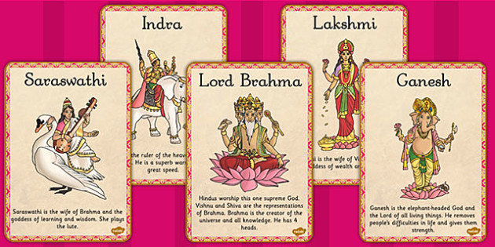

### आधुनिक सिग्देल वंशावली




###  सिग्दी क्षेत्र
#### धौलागिरी अंचल , वागलुङ्ग जिल्ला हुग्दी शिर गा.वि.स.


पुस्तकको आवरणको रुपमा दिइएको फोटो हाम्रा वंशावली संकलन श्री दुर्गा सिग्देलले त्यहाँ गई खिचेर ल्याएको हो । १३ औँ शाताब्दीको मध्येतिर र जुन ठाउँमा हाम्रा प्रातः पुज्यपाद पितामह श्रीकृष्ण भट्टाचार्य आफ्नी स्नेहमयी माताका साथ यो क्षेत्रको सेराफेरोमा बिर्ता पाई यहीको पवित्र मट्टीमा कुलापत्यहरुको वंशबीज छर्दै आफु त्यही धर्तीमा समाहित हुनुभएको थियो । भगत्रुप श्रीकृष्ण र उनका परवर्ती प्रातः स्मरणीय पुर्वजहरुले सुम्सुम्याएका यहाँका डाँडा भञ्ज्याङ्ग, गल्छेँडा डील कान्ला र समग्र मट्टीने हामी वंशापत्यहरुका लागि गंगामाटी भन्दा पनि अति पवित्र हाम्रा कुलका लागि जुन स्थान काशी प्रयाग भन्दा आदरणीय र पुज्यतीर्थको रुपमा रहेको छ । धन्य छन् ती बन्धु बान्धवहरु जो अद्यावधि त्यही धर्तीमा आफ्नो जविन त्यहीको हावापानि र अन्नका रसहरुले आफने शरिर पवित्र बनाइ राख्ने शुभ अवसर पाइरहनु भएको छ । हामी त्यस धर्तीबाट टांढिएर गुजारा गर्नबाध्य बन्धुहरुका लागि त्यहाँ बसने सबै बन्धु बान्धवहरुको स्र्पश नै पनि रोमाञ्चकारी आनन्ददायक हुन्छ । त्यही माटोमा उत्पादित फलफुल तथा अन्नको रसप्रवाह आफ्नो शरीरमा  गराउन पाउनु अनि सिग्दी ओलाको पवित्र जलले स्नान गरेर जीवन धन्य बनाउनु हाम्रो लागि उक्त स्थानको चित्र कवि सिद्धिचरणको ‘‘ तर खेद छैन तिम्रो आकृति लेखिएको छ ह्रदयभरि ” उक्ति झैँ त्यस पवित्र ठाउँको चित्र आफ्नो अन्तस्थलमा राखेर पनि धन्य र पवित्र बन्न सकुन भन्ने उद्देश्यले त्यस ठाउँको चित्रनै आवरणमा दिन कसरत गरिएको हो । उक्त चित्र यहाँ दिन सक्ता हामी यस काममा जुटेकालाई निकै सन्तुष्टि लागेको छ र अन्य बन्धुहरुलाई पनि सन्तूष्टिको विषय हुने छ भन्ने ठानेका छौ ।

#### भौगोलिक अवस्था

नेपाल अधिराज्यको मध्य पश्चिमाञ्चल क्षेत्रमा पर्ने पहिलेको गुल्मी र हालको बाग्लुङ्ग जिल्लामा रहेको यो ठाउँ पहाडै पहाडले भरिएको सुन्दर ठाउँ छ । कही थुम्क्याइला पहाड र कही चुलिएर अग्ला बनेका पहाडहरु स्वयंमा पनि दर्शनीय छन्् । शालिग्राम उमार्ने कालीगण्डकी नदीको काखैतिर अवस्थित यस सिग्दी क्षेत्रमा ‘‘ काली किनारमा सुन फल्छ” भन्न्ो नेपाली आहान चरितार्थ भएको पइिन्छ । नातिशीतोष्ण जलवायु भएको यस ठाउँमा हाम्रा पितापुर्खाहरुले डाँडाको माथिल्लो भागबाट शितल वायुस्पर्श प्राप्त गरे भने बसोबास गर्न उपयुक्त बीचको भागमा बासस्थानका लागि आश्रय र तल्लो उर्वरा भागमा अन्न बालीनाली उब्जाएर  तीनवटै मिश्रित जलबायुबाट पाउने स्वादको उपभोग गरेको पाइन्छ । हुग्दी शिर र सिग्दी खोलाहरुले परिवेष्ठित गरी सिञ्चित गरिएको यो ठाउँ निक्कै रमणीय र सुन्दर भुबनौट सम्पन्न क्ष्ोत्रको रुपमा लिन सकिन्छ । यस क्ष्ोत्र र ठाउँका विशेषताहरु तल क्रमशः दिइन्छ ।  

- १ गाजादह

हुग्दी शिर र विरंदी बजारको उत्तरतिरको भागमा अवस्थित यो ताल निक्कै ठुलो र यस क्षेत्रकै दर्शजीय स्थलको रुपमा प्रसिद्ध छ । यसको क्षेत्रफल करीब एक हेक्टर छ ।

- २ विरंदी बजार

सिग्दी गाउँको उत्तर पुर्वी भागमा अवस्थित यस बजारको आफ्नै ऐतिहासिक महत्व छ । यही बजारको मध्य भागमा चौविसे राजपरम्पराले धेरै वर्ष मौसमी दरवारको रुपमा प्रयाग गर्दाको सुन्दर कोट अद्यापि छदैँछ ।


- ३ अर्र्जेवा वा अर्जी

राजा च्यवनभट्ट(चावा) ले आफ्नी जेठी पत्नी र उनका सन्तानहरुलाई विर्ताको रुपमा व्यवस्था गरेको अर्जेवाको इतिहास राख्न होला आज पनि एक गा. वि. स. कै नामाकरणबाट इतिहास सुरक्षित राखिएको छ । हाम्रा आत्रेय गोत्री अर्यालहरुको मुल थलोकोे रुपमा रहेको पुण्यभुमि अहिले पनि हेर्न सकिन्छ , गएर छाम्न सकिन्छ ।

- ५ सिग्दी गाउँ

मगर भाषामा पनिीलाई ‘डी’ भनिने हुनाले अहिले धेरै खोला र नदीहरुको पछाडि ‘डी’ श्र ‘दी’ उच्चारण रहेको पाइन्छ । उदाहरणका रुपमा मस्र्यादी, दरौंदी , रामदीहरुलाई लिन सकिन्छ । तत्कालीन मगर भाषाबाट प्रयसक्त सिक्डीले सिग्दीको रुप लिएको स्पष्टै छ । सिग्दी खोलाको उत्तरतिरको सुन्दर ठाउँमा अवस्थित यो गाउँ पनि दक्षिणतिर कलकल बग्ने सफा सिग्दी खालो झैँ सुन्दर र सफा छ ।

- ६ सिग्दी 

सिग्दी गाउँको दक्षिणबाट पश्चिमतिर बग्ने यस खोलाको शितल र सफा जलले यहांको भुमि हराभरा , उर्वरा, शस्यश्यामल बनाइएको छ । हाम्रा पुर्वजहरु यसैमा स्नान गरेर आफ्ना दिनचर्याहरु शुरु गर्दथे अनि आफ्ना कुल देवतालाई यहीको जल अर्पण गरेर वैशवृक्षलाई सेचन गर्दथे । हामी सिग्देल गनेत्रापत्यहरुका लागि यो पावन नदी गङ्गा भन्दा पनि पवित्र र उच्च छ ।

- ७ हुगदी शिर

हाल गा. वि. स. कै नामको रुपमा राखिएको यो गाउँ हुग्दी खोलाको दक्षिणपुर्वमा अवस्थित छ । यस ठाउँ पनि पश्चिमोत्तरमा बहने हुग्दी खोलाको पानि शिर अनुरुपनै नामाकरण गरिएको पाइन्छ ।

- ८  सेरा बेंसी

यो निकै उर्वरा र सुन्दर बेंसी छ । यही बेंसीमा यहाँका तत्कालीन राजाहरु स्वयं खेती गरेर अन्य रैतिहरुलाई उदाहरण दिन गर्दथे भन्ने लोकोक्ति पाइन्छ ।

- ९ केवलपुरी

सिग्दी गाउँको दक्षिण पश्चिममा अवस्थित यो सुन्दर थुम्को हाम्रो पुर्वजहरुले कुल पुजा गर्ने गरेको पवित्र स्थल हो । तयहाँ हाम्रा पुर्वजहरु भेला भई हाम्रा कुल देवताको पुजा उत्साह र भक्तिका साथ सम्पन्न गर्दथे । त्यो प्रचलन अद्यापि छदैछ ।

- १० कुल देवता  

त्यहाँ पुजिने कुल देवताको नाम रतनपुरारी हो । यो नाम कुलपुजाको रुपमा कसरी रहन गो भन्ने बारेमा अनुसन्धान अन्वेषण हुन बाँकी छ । अनुमान चाहिं के गर्न सकिन्छ भने हाम्रा पुर्वजहरुमा रतनमुरारीको कुनै उल्लेख्य प्रतिभा सम्पन्न दैव रुपमा उदाएको हुनुपर्दछ । जसलाई पछि कुलायनकै रुपमा प्रतिस्थापन गरियो । कुल पुजा बाहेक ‘ अँयर भँयर ’ पुजालाई पनि सामुहिक महत्व दिइन्छ ।

- ११ रीतिरिवाज

‘बासठ्ठीहरण’ (इतिहास प्रसिद्ध विर्ताहरण ) पछि गुल्मेली राजाले विर्ता  हरण गरी त्यहाँके जग्गा रैकर बनाएको प्रतिशोधमा त्यहाँका राजाको हातको पानि हाम्रा बन्धुहरुले खादैनथिए भन्ने लोकोक्ति पाइन्छ । हाम्रा त्यहाँको  बन्धुहरुले गुल्मेली राजाको दरबार क्ष्ोत्र भित्र हालसम्म पनि पानि नखाने र कसैले खाएमा उसको जात जाने भन्ने प्रता अहिले पनि छ । पानी नखाई नहुने अवस्था परेमा तीन पटक उफ्रेर ‘रैकर गयो ’ भन्यो  भने बात लाग्दैन भन्ने भनाई अद्यापि छदैछ । अर्को एक रोचक किंवदन्ती भने यस्तो छ –( हाम्रा पुर्खा भट्टहरुले नित्य पुजा गरेका पुजाकोठाका देवताले धन सम्पतिको अति आवश्यक परेको बेला ती देवतालाई पुकार्दा दिनको एक मासाका दरले सुन पुजाकोठामा पाइन्थ्यो र त्यस्तो सुन दिने देवतालाई दरबारिया गोतामेले चोरी गरी गुल्मेली राजाको दरबारमा पु¥याउने चलन अहिले पनि छदैछ । त्यहाँ सोमबार बारिन्छ ।

- १२ कुलपुजा विधि

कुलपुजा (देवाली) गर्ने मुख्य कर्ता बन्धुहरुबाट निर्धारण गरिन्छ । त्यो मूख्य कर्ताले अघिल्लै दिन केश मुण्डन गरी एक छाकी बस्नु पर्छ , शुद्ध बस्नु पर्छ । देवाली गर्ने दिन नित्य स्नान गरी मोही पारी धुप, अक्षता , ध्वजा पताका लिएर सबै बन्धहरु सहित पुजास्थलमा जानु पर्छ । त्यहाँ कुलायनको मुख्य दियो जलाएपछि मुख्य कर्ताले एकोदिष्ट श्राद्ध गर्नुपर्छ । तर्पण गर्दा देव तर्पण , पितृ तर्पण गर्नुपर्छ । श्राद्धको काम सकेपछि कुलपुजा गरिन्छ । ध्वजा पताका , सिन्दुर, धुप बत्ती गरी आरती गर्नु पर्छ । कुल देवतालाई शुद्ध ब्राह्मण वा ब्राह्मणीले पकाएको पायस ६४ कोठामा अर्पण गरिन्छ । यज्ञ समाप्त भए पछि च्यही यज्ञमा प्रयाग गरेको चामलको महाप्रसाद बनाई खाइन्छ । भेटी चढनएको रुपियाँ पैसा चेलीबेटीलाई दिइन्छ । त्यो महाप्रसाद अन्य थरका मानिस र विवाहित आफ्नै चेलीलाई पनि दिनु हूदैन । महाप्रसाद घरमा लानु पनि हुदैन , त्यहीं खाइसक्नु पर्छ । मुख्य कुलायनको दियो स्त्री जातिले हेर्नु हुँदैन गैंडु पुजा भने मार्ग शुक्लमा र जेष्ठ शुक्ल पुर्णिमामा घर वा गोठमा गरिन्छ । (उक्त टिपोट संकलक दुर्गा सिग्देलबाट प्राप्त भएको आधारमा तयार गरीएको हो । त्यसमा केही कुरा नमिलेको भए तथ्य प्राप्त भएपछि सच्याइने छ ।)

यस क्षेत्रमा सिग्देल थरको मान्छे पाइँदैन । आफुलाई सेता पौडेल भन्ने बाहुनहरुको बसोबासो पाइन्छ । यस बारेमा के अनुमान गर्न सकिन्छ भने यस ठाउँबाट अन्यत्र बसाई गई बस्न थालेपछि मात्र त्यस समुदायलाई सिग्देल(सिग्दीबाट आएको ) भन्ने प्रयोजनमा थर प्रयाग भएको हुनुपर्दछ किनभने अहिले पनि कुनै ठाउँको बासिन्दा भएकै  कारणबाट त्यस परिवारको नामाकरण भएको प्रचलन पाइन्छ । जुम्लाको बासी जब जुम्ला छोडेर वा आछाम वस्ने आछाम बाहिर बसोबासो  गर्न थाले पछि त्यो ठाउँमा उक्त नवआगन्तुक परिवरको नाम उसको पुर्वथलोको हिसाबले विशेषण बनाएर आछामबाट आएको आछामे, लालीखर्ककाट  आएको लालीखर्के , फुदुकबाट आएको फुदुके , गोदकबाट गोदके र्भ झैं हाम्रा त्यहाँका पुर्वजहरु अन्य ठाउँमा गई बसोबासो गर्न थालेपछि ने सिग्द्याल श्र सिग्देल  (सिग्दी ं आलय) शब्दले थरको रुप लिएको हुनुपर्दछ । त्यस समयको सेरोफेरोमा दैलेखका कतिपय ठाउँहरुबाट २२ किसिमका थरहरु प्रादुर्भाव भएको तथ्य पाइन्छ । पोडेल, अज्र्याल लगायत खनाल , नेपाल , लुईटेल , चापागाई ,गुरागाई , भुर्तेल , दुलाल आदि थरको प्रादुर्भावले  समेत यस कुराको पुष्टि गर्दछ । त्यसकारण सिग्दी गाउँमा सिग्देल थरबाट सम्बोधन गरिने परिवार नपाइएको  हुनु पर्दछ । या त यहाँको त्यसबेलाको सिंगै परिवार अन्यत्रै गएर त्यस ठाउँमा पौडीका सेता खलक आएर बसोबासो गरेको कारणले पनि यो परिस्थती भएके अनुमान गर्न सकिन्छ । ‘‘बत्ती मुनी अँध्यारो” भने झैँ त्यस मुल थलोमा सिग्देल थरको परिवार नपाइएकोले  त्यहाँको पुस्त्यौनिको नामावली  दिइरहनु परेन । तथापि त्यस ठाउँमा अध्यावधि  गदैँ आएको कुल पुजा(देवाली ) आदि रीतिरीवाज सामाजीक प्रचलन हाम्रा पुर्वजहरुले गरेको कृत्य परम्परासँग आवद्ध छन् भन्ने अर्थमा त्यस प्रचलनको बयान गरिएको हो ।    


### स्याङजा क्षेत्र
#### गण्डकी अञ्चल, मग्याम चिसोपानी गा.वि.स.


पोखरा पुग्लिङ् सडकको दुलेगौडा भन्ने ठाउँबाट पैदल घोरेटो बाटो पुरै एकदिन पैदल हिंडेपछि चिसापानी भन्ने सुन्दर गाउँमा पुगिन्छ । चिसापानी गा.वि.स. कै रुपमा नामकरण गरिएको यस ठाउँको प्राचिन नाम भने ‘मयम’ रहेछ । यहाँ अघि महिमा नाउँका ऋषिले तपस्यासाधना गरेर वसेकाले यसको नाम पनि मग्याम रहन गएको यहाँका बुढापाका बताउँछन् । चारैपट्टि डाँडाले घेरिएर बीचमा जमिनको समथर उपत्यका साच्चैनै दर्शनीय छ । आँखाले भ्याउन्जेल  हेर्दा बस्तीले ढाकेको यसको बनावट माानव प्रकृतिको विशाल थाल हो जहाँ वरिपरि  सुन्दर हरिया डाँडा, अनि त्यस मुनि रमाइल हरिया पाखा र वीचमा बेंसी साच्चैनै मनोरम उर्वरा भुमि सँधै वरिपरि डाँडा बाट घुम्दै दृश्यपान गरिरहुँजस्तो लाग्दछ । बीचमा हरिया रेखा जस्तै बग्ने खोल्सो नाम जस्तै शितल ‘चिसापानी ’ नै रहेछ  जसले हेर्ने दर्शकलार्ई आखैभरि शितलता र बस्ने बस्तीलाई पेटैभरि अन्न उब्जाउँदे रहेछ । विकट डाँडा गल्फा काटेर जानु परे पनि डाँडाबाट झट्ट बस्ती देख्ने बित्तिकै सारा थकान मेटिदो  रहेछ । वरिपरि पहाडले घेरिएको तथा उच्च समस्थली बेंसी ‘ चिसापानी ’ नै रहेछ । यातायातको रुपमा प्राय खच्चर प्रयाग हुँदा रहेछन् । व्यापारका लागी बजार तथा शिक्षाका लागि विद्यालयको व्यवस्था  आदिले यो ठाउँ एउटा छुटै स्वर्ग हुँदो रहेछ । यस उपत्यकाले मात्र यस गा.वि.स. को वार्ड नं ७ , ८ र ९ क्षेत्र ओगट्दो रहेछ । यस बस्तीको छुट्टै एक विशेषता सायद अन्त कतै पाइदैन । त्यो के भने यस बस्ती भरी सिग्देल र लम्साल बाहेक अरु थरका मानिस का पाइँदा रहेछन् । हाम्रा संकलक दुर्गा सिग्देलको टिप्पणी छ ।


#### कुलपुजा विधि 

हरेक वर्षको मार्ग शुल्कको द्वादशी तिथिमा त्यस गाँउभरका बन्धुहरु मध्येको कुनै एक घरमा सबै बन्धुहरुले आ–आफ्ना घरबाट त्यसै दिन मोही मारेको नौनी घिउ , ध्ुप, बाती र  नयाँ चामल सम्पुर्ण सामाग्री  लिएर भेलाहुँदा रहेछन् । सो घरमा मुल मान्छेले भने अघिल्लै दिन केश मुण्डन गरी एक छाकी समेत बस्ने गर्दा रहेछन् । उनै मुख्यकर्ता हुँदा रहेछन् । सबै बन्धु मिलेर तुलसीको मोठमा नयाँ चामल आहुती , गोठमा गैडु पुजा  तथा घरभित्र चुलाम कुलपुजा तीनवटै काम सबैतिर एकै चोटी गर्ने  चलन रहेछ । यी तिनै कामको महाप्रसाद घर आँगन परिधि बाहिर न लाने र अन्य थरकालाई त्यो प्रसाद नदिने पनि चलन रहेछ । यो सबै यज्ञको काम , अन्य कसैलाई हेर्न समेत पनि दिइँदो रहेनछ । यहाँ ल्याइएका पुर्खा चाहिँ किंहुँबाट अनाथरुपमा (चोरेर) स्वाट्ट मावल ल्याएर वंश वृद्धि भएको भन्ने पनि भनिन्छ ।
यस क्षेत्रका पुख्र्यौलीको इतिहास श्री कृष्णबाट १३ पिडीँका गुजेश्वरी र २२ सौँ पिडीँका नन्दुपाध्याबाट यहाँ पुख्र्यौलीको इतिहास भेटिन्छ ।


-------------

(Family Trees getting ready soon....)


----------------


### तनहुँ क्षेत्र
#### अंचल गण्डकी, किहुँ र अरुणोदय गा.वि.स.


गा.वि.सको नामकरण अरुणोदय भएपनि दुबै गा.वि.स. किहुँ ईलाकामा पर्दछन् । किहुँ वर्तमान नेपालका शाहवंशको तत्कालीन अवस्थामा नेपालभित्र प्रथम राज्य आर्जन गरेको भीरकोटको हाराहारीमा पर्ने यस किंहुँको पनि त्यस्तै ऐतिहासिक महत्व छ । पोखरा मुङलिङ्ग सडकको खैरेनीटारबाट भीमबाँधसम्म सेती किनार दक्षिण जानुपर्दछ । भीमबाँधबाट  निर्माणाधीन भीकालीमार्ग हुँदै करिब १२ कि.मि. १ दिन पुरै पैदल हिँडेपछि किंहू पुगिन्छ । किंहैू पुगिन्छ । किंहुँ र अरुणोदय दुबै हाम्रा पुर्खाहरुलाई तत्कालीन भिरकोटे  राजाबाट बिर्ताको रुपमा उक्त स्थान प्राप्त भएको हो  भनेर यहाँका बुढापाका भन्दछन् । यस ठाउँमा पनि पानी पर्याप्तं हुनाले किंहु नामाकरण भएको हुनुपर्दछ ।

- आम्बोटः– यो परानो गाउँ हो र सबैभन्दा पहिले प्राप्त भएको बिर्ता हो भन्ने भनाई छ । पहिले यहाँ आएर सिग्देलहरु बसेका हुन् भनिन्छ ।

- खुदेपानीमाः– यो पनि निकै पुराने गाउँ हो र बिर्ताको रुपमा प्राप्त गरेको हो भन्ने पाइन्छ । यहाँ एउटा खोल्सो छ । हाम्रा पुर्वजहरुको पानी खाने पधेरो यही हो ।

- पीतपानीः– यो पानीको मुल धारो आम्बोट बिर्ताभित्र पर्दछ र यसलाई ‘बिर्तापानी’ पनि भनिएको हो ।

- भीरकोटको बाराही मन्दिर ः–

अरुयोदय गा.वि.स को वार्ड नं. ३ मा अवस्थित यो मन्दिरमा बाराही देवीको मुर्ति स्थापनागरी हाम्रा आदरणीय पुर्वज गोबिन्द पहिले पुजा गर्नेगर्थ भनिन्छ र हालपनि निजकै सन्तान तिलकरामको नाममा नवीकरण भएकोले पुजाआजा गरिरहेका छन् । पुजाको क्रम निरन्तर चलिरहोस् भन्ने आशयले गोबिन्दराजले गुठीको पनि व्यवस्था गरेको पाइन्छ । पुजा गरेवापत पहिले पनि बिर्ता समेत पाएकाहुन् पनि भनिएको छ । दशैमा यहाँ पञ्चावली दिनका लागि मौलो राखिएको छ । यहाँ दशैंमा बली दिइन्छ ।

- खीर पकाउने डाँडाः–

बडर भञ्ज्याङ्ग भन्दा केही उत्तरपट्टि अवस्थित यो डाँडामा हाम्रा सिग्देल बन्धुहरुले कुलपुजा गर्दा खीर पखाउने तथा सामुहिक कुलपुजा गर्ने पवित्र स्थान हो ।

- सतीकोट ः–

दुवलदेखि पछिका चर्चित  व्यक्ति राधाकृष्ण पाध्येको यहाँ घर थियो र घरको अवशेष चाहिँ अद्यापि देख्न पाइन्छ । यिनी त्यतिखेरका यिनेगिनेका जिम्मावाल थिए ।

- हुक्का, बोमा, कुलुङ बेशीः–

किहुँका जिम्मावाल लक्ष्मीपति पाध्येले  तत्कालीन भीरकोटका राजालाई विशेष किसिमको हुक्का भेटी चढाएकाले सो वापत प्राप्त भएको बिर्ता आजपनि ‘हुक्काबोमा’ नामले पुकारिन्छ । सो बिर्तामा बस्ने यहाँका हाम्रा बन्धुहरु आजपनि सुर्ति र सुर्तिजन्य कुनैपनि वस्तु सेवन गर्दैन्न , गर्नु हूँदैन भन्ने किंवदन्ती पाईन्छ । उक्त बिर्ता वि.सं. १७०० मा नवीकरण भएको देखिन्छ ।

- कुलपुजाः–

कुलपुजा व्यक्तिगत र सामुहिक गरी दुवै किसिमले गरिन्छ । व्यक्तिगत भन्नाले सामुहिक कुलपुजा गर्नेदिन मार्ग शुक्ल पुर्णिमाका दिन प्रत्येक घरमा पुलीले यसरी गर्नुपर्दछ–

- व्यक्तिगत कुलपुजाः–

प्रत्येक घरको भुईतलाको गाह«ोको खोपीमा कुलाइनको दियो राखेको हुन्छ । दियो राखेको वरिपरि कमेरोल नै पोतेको हुनुपर्छ । त्यो दियो घरमुलीले मात्र चलाइन्छ । यदि कुनै कारणले दियो खस्न गयो भने घर मुलीलेमात्र स्नान गरेर दियो जलाएर राख्नुपर्छ । यो मुल दियोलाई कुलाइनको दियो भनिन्छ र स्त्री जातिले छुनै हुँदैन । कुलपुजाको दिन चाहिँ मुल दियोको ठीक तल भुईमा तीन थान लस्करै थाल राख्नु पर्दछ । बीचको थालमा चामल मुठी ८ र दुवैतिरका थालमा ४÷४ मुठी चामल बीचकोमा दियो र दुबै तिरका थालमा कलश राखेर कुल संझी पुजागर्ने गरिन्छ । यस्तो कुलपुजाको अघिल्लो दिनदेखि नै चोखा बस्नुपर्छ । चोखा बस्नु भनेको अघिल्लो दिन केश काटी एकछाक मात्र खाने र त्यसदिनदेखिकै आफ्ना घरको दुध दहि कसैलाई दिन वा बाँडन हुदैन । यसरी भुमिमा राखेर पुजा गरेको दियो पुनः खापीमा कुललाई संझेर आदरभावसँग राख्नु पर्दछ र क्षमापराध संझनु पर्दछ । अब घरको दुध, नौनी , चामल, धुप बाती लिई सामुहिक कुलपुजा स्थालमा सामेल हुनुपर्दछ । सामुहिक पुजा सकेर घर फर्केपछि बिहान चामल भए दुधमा , छैन भने पानीमै भएपनि घरमुलीले स्वंय पकाएर कुल संझदै संझदै खाने गरिन्छ । यो पाक्य भिन्न गोत्र कसैलाई दिइदैन । उब्रेमा खाल्टो खनी गाडिदिनुपर्दछ । भाँडाबर्तनसमेत घरमलीले नै सफा गर्नु पर्दछ । हाल भने उक्त कतिपय कुरामा क्रमशः शिथिल हुदै गएको पाइन्छ ।

- सामुहिक कुलपुजाः–

माथि भनिएझै प्रत्येक घरमा कुलपुजा गरेका घरमुलीहरु र घरका अन्य सदस्यहरु निश्चित एक ठाउँमा प्रत्येक घरबाट दुध, घ्यु, चामल, धुपबाती र फुलप्रसाद लिएर भेला हुने गरिन्छ । सामुहिक कुलपुजामा बैदिक बिधिले अग्निस्थापना गरिन्छ । बन्धुवर्गकै सदस्यबाट रुद्रीबाट रुद्रीपाठ, चण्डीपाठ गरिन्छ । एकापट्टि यज्ञ सम्पन्न हुदै रहन्छ भने अर्कोतिर गैडुपुजा पनि हुदै रहन्छ । गैडुपुजा गरेको र प्रसाद चढाएको स्थान घेरेर राखिन्छ । कुनैपनि स्त्री जातिले यो हेर्न हुँदैन । मात्र बन्धुहरुले हेर्नु हुन्छ ।यज्ञस्थालमै प्रसाद तथा खानेर गाडीदिनुपर्दछ । उब्रको प्रसाद अथवा कुनै पनि खाद्य बस्तु घरमा ल्याउनु हुदैन । बरु खाल्टो खनेर गाडिदिनुपर्दछ । देवाली वा कुलपुजालाई ‘लुकुवा’ पुजा पनि भनिन्छ । कुलपुजा बाहेक ‘ अँयर भयँर ’ पुजा पनि भन्ने गरिन्छ । यहाँका बन्धुहरु सोमबार बार्छन् । कुनै शुभकामको थालनी वा घर कटेरा छाप्ने वा बार्ने गर्नु हूँदैन । कुलदेवताको नाउँ(क) अग्निधर (ख) धरणीधर ।


-------------

(Family Trees getting ready soon....)

-----------

### कृस्तीः बहेले क्षेत्र

यो गाउँ पोखरा नगरपालिकाको छोरेपाटन(डेभिसफल) बाट १ किलो मिटर पश्चिम दक्षिण फुर्सेखोला पारी स्याङ्जा जाने पुरानो बाटोमा पर्दछ । पुर्व उत्तर फर्केको पाटो हुनाले सँधै जस्तो हराभरा भइरहने हुनाले सुन्दरताको दृष्टिले पनि सुन्दर यस ठाउँके बिषेशता भने शहर छर्लङ आखाभरि देख्न पाइने र सुन्तला उत्पादन गर्ने क्ष्ोत्रहरु मध्येमा पर्दछ । यहाँ लिटरम्म सुन्तला त फल्छ नै साथै अन्य बालीनाली उब्जाउन समेत यस क्षेत्रको आफ्नै अलग बिशेषता छ । यहाँका बन्धुहरु शहरको अलि साँघुरो खालको अतिथि सत्कार भन्दा आत्मीय र हार्दिकता पुर्ण अतिथि सत्कारमा रमाउँदा रहेछन् । भित्रैदेखि पोखिन जान्ने सहृदयी भावना भएका सरल मान्छेहरु  बसोबासो गर्ने थलाके रुपामा यो ठाउँ परिचितछ । शहरको न त्यति नजिक अनि न त्यति टाढा भएपनि गाउँले शिष्ट जीवनशैली टडकारै देखिन्छ । यहाँ पुर्वजहरु किहुँबाट किहुंबाट आएर बसोबासो गर्न थालेका हुन् भनेर बन्धु बालकृष्ण सिग्देल बताउनुहून्छ ।

#### कुलपुजा

कुलपुजा ज्येष्ठ शुल्क पुर्णिमामा गरिन्छ। कुलदेवताको यहि नाम हो भनेर किटान छैन। ‘‘लौ परमेश्वर ” मात्र भनेर गरिंदो रहेछ । जुठो वा सुतक परे अर्को साल गरिन्छ । त्यतिबेला पनि रोकिए अर्को साल गरिन्छ । कुलपुजा गर्दा दाजुभाई मध्येका ज्येष्ठबाट १०८ पटक पानी समाती (संकल्प) गरेर अग्निस्थापना बिधिबाट पुजा गर्ने गरिन्छ । पुजा सामाग्री बोकेर  हिंडेपछि अन्य थरका कुनै मानिससँग बोल्नु हुँदैन । छेवर नगरेका छोरालाई पुजास्थलमा लानु हुँदैन । कुनै बन्धुहरुको जेठो छोराको जन्म भए, घर बनाएको भए वा विवाह गरेको भए साविकमा एक दियो अर्को थपेर पुजा स्थलमा लानुपर्छ । घरको मुलदियो अरु थरकाले छुनु हुँदैन र कुलपुजा बाहेक अन्य कार्यमा बाल्नु पनि हुँदैन । पुजास्थलमा बनाएको वा बाडेको प्रसाद घर ल्याउन हुदैन । कुलपुजा गर्दा दुइतले स्थान बनाइन्छ । माथिल्लो तलमा कुलपुजा गर्ने गरिन्छ । घर घरमा अघिल्लो दिनदेखि चोखा राख्नु पर्दछ । यहाँ सोमबार बारिन्छ । नागपञ्चमीका दिन यहाँका बन्धुहरु सामुहिक नागपुजा गर्दछन् । व्यक्तिगत घरमा नाग टाँसिदैन ।


---------

(Family Trees getting ready soon....)

-----------


### कास्की जिल्ला
#### पोखरा र आर्वा गा.वि.स. निर्मल पोखरी


यो ठाउँ पोखरा नगरपालिका भन्दा ४–५ कि. मी माथि समथ¥याइलो पहाडको माथ्लो भागमा अवस्थित छ । सम्पुर्ण पोखरा तथा ताल तलैया र सेती पारिका इन्द्रपोखरी , भरतपोखरी समेत कृस्ती गाउँपनि  टडकारै देखिने , सँधै हेरिरहुँ झै लाग्ने यो ठाउँ पोखराका सुन्दर उपवर्ती ठाउँहरु मध्येमा पर्दछ । हाम्रा पुर्खाहरुको वेसी खेतिहरु भएका ठाउँमा वर्तमान पोखरा शहरको निमार्ण भएको इतिहास बखान्छनु यहाँका बासिन्दाहरु । त्यसैले यहाँका बन्धुहरु आर्थिक हिसावले निकै सम्पन्न रहेछन् । धेरैजसो बन्धुहरुकै बसोवास तथा घर पुरानो शहरतिर भए पनि पितृ प्रसादको रुपमा यो ठाउँको स्वामित्व भने गुमाएका रहेनछन्  र चाँहदापनि रहेनछन् हालको पोखरा शहरको औद्योगिक क्षेत्र माथिल्लो सिमलचौर , तल्लो सिमलचौर , लेखनाथ नगरपालिकाको बुढीबजार यहाँका वन्धुहरु विस्तार भएका हुन् भनेर बताउँछन् । यहाँ बन्धुहरु खेतीमा भन्दा उद्योग व्यापारमा नै बढी संलग्न रहेछन् ।

- कुलपुजा स्थल 

आर्वा गा.वि.स को वडा नं. ४ नयाँ ‘खोर’ भन्ने ठाउँमा सामुहिक कुलपुजा स्थल छ । हाल त्यहाँ मन्दिर र कुलपुजा स्थल निमार्ण गर्न चन्दा संकलन समेत भएको रहेछ ।

- कुलपुजाः

हरेक ३ वर्षमा मार्ग शुक्ल पुर्णिमाको अघि वा पछि उपयुक्त दिन ठह¥याउर पुुजा गरिन्छ ।यहाँ चोखा वस्ने चलन रहेनछ । आफ्ना कुलका छोरीचली बाहेक कुलपुजा स्थलमा अन्य थरलाई लान हुँदैन । प्रसा दभने घर लान पनि हुँदो रहेछ ।

- कुलदेवताः

यहाँका पुर्वजहरु किहुँबाट आउँदा काली गण्डकीबाट दुइटा शिला समेत लिएर आएको बताउँछन् । किंहुँमा उल्लेख गरिएका अग्निघर र धरणघरलाई तिनै शिलामा कुलपुजाको प्रतीक मानेर कुलपुजा गरिन्छ । पोखरा नगरपालिका वडा नं. १२ मा बस्ने एक शाखा भन्ने हरेक सालको मर्गशुक्ल पुर्णिमामा उक्त वार्डमा रहेको भद्रकाली मन्दिरको परिसरभित्रको जंगलमा कुलपुजा गर्ने गर्दछन् । गैडुपुजा पनि साथै हुन्छ । एक दिन अगावै चोखा राख्नु पर्दछ । सो स्थलम विवाहित छोरीचेली तथा अन्य थरकालाई लगिन्न । कुल देवताको नाम रतनमुरारी हो ।
  यस क्ष्ोत्रका बन्धुहरुको इतिहास श्रीकृष्णदेखि तेह्रौका गुजेश्वरी र एक्काइसका शशिधरबाट पूस्तयौनी शुरु हून्छ ।

----------

(Family Trees getting ready soon....)

-------------


### काठमाडौ उपत्यका , दहचोक क्षेत्र


तत्कालीन ललितपुर इलाका र हालको काठमाडौमा पर्ने यसै ठाउँको थानकोटदेखि उत्तर पश्चिमकोण गैरीगाउँ , टिमुरेधारी ढुँगेडाँडा क्षेत्रभित्र बसोवास गर्न अनुमति पाएका हाम्रा पुर्वज स्वनामधन्य श्री सदाशिवले यस क्षेत्रमा पहिलो पल्ट बसोबासो गरेको रोचक किंवदन्ती आज पनि यस क्षेत्रका बन्धुहरु बखान्छन् ।

पाटनका प्रसिद्ध राजा सिद्धिनरसिंह मल्लको शासनकालमा पाटन तथा यस आसपासका क्षेत्रतिर एकपट प्लेगको महामारी फैलिएर सारा राज्यमा हाहाकार मच्चियो । यस प्लेग महामारीको शमनको उपाय गर्न धन्वन्तरी वैद्यहरुको खोजी कार्य व्यापकसँग गरियो । यसै क्रममा हाम्रा पुर्खा श्री सदाशिवको नाम राजालाई सुनाइयो । सिग्दी भन्ने ठाउँमा बस्ने वैद्यराज सदाशिव आएर प्लेग महामारीबाट बचाउन उपायको रुपमा यज्ञ गरे । यो यज्ञ दुई ठाउँ धुमधामसँग गरियो । पाटनढोका र थानकोटमा सँगै यज्ञगर्दा  परिणाम स्वरुप बादल सहित ठुलो वर्षा भयो । राग शमन भयो । यस्तो अद्भुतशक्ति र अचुकउपाय जान्ने विद्धान्लाई राजा सिद्धिनरसिंहले उनलाई उपयुक्त हुने यतै कतै ठाँउ रोजेर बस्ने आग्रह गरे । यसरी राजको आग्रह भएकाले बसोबासका लागि सबै सिकिमले उपयुक्त ठाउँ विचार गर्दा यही ठाउँ जँचेको हुनाले राजाले उक्त ठाउँमा चाहिएजति क्षेत्र चर्चित अनुमति दिएपछि यस क्ष्ोत्रमा बसोबास गर्न थालेका हुन् भनिन्छ ।

पछि राजा सिद्धिनरसिंहले ‘किन यस्तो ठाउँ रोज्यो’ भन्दा उनी बसोबास गर्ने ठाउँमा कुखुरा तथा कुकुरको आवाज सुनिनु नहुने  अनि हिमालयको सामुन्ने फर्केको पनि हुन नहुने र टिमुर आदि जडीबुटीहरु प्रशस्त पाइने , छेवैमा पखेरो अनि जलासय पनि नजिक पाइने , पुर्व–दिक्षीण फर्केको पाटो बसोबास गर्न उपयुक्त भएको कुरा राजालाई बताइएको कुरा हाम्रा यहाँका बन्धुहरु बताउँछन् । यसै ठाउँबाट हाम्रा बन्धुहरुको सन्तान थानकोट, इटाखेल, मच्छेगाउँ , कलंकीस्थान, जाउलाखेल , लैजचौर , कालिकस्थान, धोवीचौर , मैतीदेवी , सिफल , चावहेल , गोकर्ण, लिट्टिघर, कलैया, हेटौडा, दाप्चा फुलवारी, सिन्धुपाल्चौक, नुवाकोट,देखि सुदुरपुर्व ताप्लेजुङ्गसम्म बसोबास गरेको पाइन्छ ।

राजा पूथ्वीनारायण शाहले काठमाडौं खाल्डो सर गर्न नुवाकोट सर गरेपछि दहचोकमा चडाई गर्दा त्यसबखत पर्वत राजाको सैँन्यलाई भित्री हिसाबले संवत् १८०४( इतिहास प्रकाश सन्धी संग्रह भाग १, पृष्ठ ३७२ योगी नरहरिनाथ) मा सधाएको हुनाले पृथ्वीनारायण शाहका विशेष कृपा पात्रका रुपमा दहचोकवासी बन्धुहरु थिए  भन्ने कुरो इतिहासबाट थाहा लाग्दछ ।

श्री सदाशिवका छोरा शंकर र उनका तिनभाई छोरा केशव दास, गंगाराम, विद्यापतिहरुबाट पुर्व तर्फबा सबै ठाउँका बन्धुहरुको पुस्तयौनी फैलिएको देखिन्छ । दाहचोकमा भने गंगारामका छोराहरु शशिघर र कृष्णनन्द मध्ये कृष्ण नन्दका ३ भाई छोरा भए । जेठा नीलाम्वर , माइला हरिनारायण र कान्छा लक्ष्मीनाथ । यिनै तीनभाइका बंशज जेठो, माइलो र कान्छो हाँगाको नाउँले प्रचलित हुँदै गएको पाइन्छ ।

दाहचोक र बाँण भञ्याङमा यसरी धना अनि १०० घरभन्दा माथिका बन्धुवान्धवहरुको बसोबासो भएपछि उत्सव धर्मकार्य गर्ने अनि चाडपर्वहरुमा सापिण्ड, आशौचका कारण ज्यादै जटिल समस्या परेछ । मृतसुतक र जन्मसुतकका कारण धेरै चाडबाडहरु थुनिने अनि धार्मिक कृत्यहरुमा पनि व्यबधान हुने समस्याले गर्दा सापिण्य लिनु परेछ  । धर्मसिन्धु तथा निर्णयसिन्धुका निर्णयहरुलाई आधार बनाई आशौच बार्ने र फुकाउने निर्णय भएछ । यसले गर्दा धार्मिक कृत्यमा साथै चाडपर्वहरमा पनि बार्ने र फुकाउने निर्णयले सामाजिक मर्यादामा पक्षलार्ई उपयुक्त बाटो पहिल्याउन सजिलो भएछ ।

- कुलदेवता (देवाली) पुजाको निर्णय

यस भेगका सिग्देलहरुको बार्षिक कुलदेवताको पुजागर्ने स्थल परम्परादेखि नै टिमुरेघारी( गैरी गाउँ) देखि करिव आधा किलोमिटर पश्चिम ठोट्नेखखोलाको बनको उत्तर पश्चिम कोणमा  रहेको छ । मार्गशुक्ल पुर्णिमाको दिन (सो राकिएमा ) जेष्ठशुक्ल पुण्र्निमाका  दिन सबै ठाउँका सिग्देल बन्धुहरु एकत्र भई अग्निस्थापना, रुद्रीपाठ , वैदिक मन्त्रउच्चारण गरी वैदिकविधि अनुसार सात्विकी पुजा गर्ने चलन छ । यी दुवै तिथिमा पनि बारम्बार (प्रतिबन्ध) आशोच परिरहेकाले २०५३ साल मार्गमा सम्माननीय बडा गुरुज्यु श्री नयराज पाण्डेको आदेश बचनको लागि अनुरोध गर्दा वहाँले पुजाकार्य लोप हुन नदिन मार्गशुक्लमा रोकिएमा पौषशुक्ल र जेष्ठशुल्कमा रोकिएमा आषडशुक्लमा पुजागर्दा हुन्छ भन्ने निर्णय दिनुभएकोले २०५३ सालमा त्यही निर्णय भएछ । यसरी कुनै हाँगोमा अशोच रहे अन्न्य हाँगाले पुजा गर्नेगरी बन्धु बाधवहरुको गोष्ठीले निर्णय गरेको रहेछ ।

- कुलपुजाको नियम ः–

मार्ग शक्ल एकादशीका दिनबाट केही भाडाँ माझी सफाराखी गाई भैसीको दुध दुहेर तताए पछि अति अतिथी बालक कसैका लाथि पनि नचलाई ठेकी भाडाँमा जमाउने , यदि बजारमा विक्री गर्न पर्दछ । पहिलो बेते गाई घर–गोठामा भएमा चोख्याएका दिनको दुध चढाउनु पर्छ । कुलदेवतालाई देवाली पुर्णिमाका दिन खीर नचढाई त्यो गाईको खीर पकाउने हुँदैन र नचोख्याई भातमा जुठो गरी खानपनि निषेध छ । पुर्णिमाका दिन स्नानगरी मोही पार्ने  र सो नौनी र माही समेत कुलदेवतामा पुजामा  लैजानु  पर्दछ । पहिला बेते गाईको चोख्याएर खारेको सफा ध्यु भएमा साथै लानु पर्दछ । होम गर्ने ध्यु र चरु समेत त्यसै ध्युमा तयार गर्नु पर्दछ  अनिर्वा भने छैन । हामको पुजा सामाग्री सहित एकादशी पछि कुटिएको चामलको पिठो तयार गनुर्् पर्दछ । यदि जेठो छोरा वा नाति जन्मेको भए एक भाग पुजा सामान बढी रातो , सेतो ध्वाजा सहित  दियो १ , घण्टा १ लिएर उक्त बालकलाई लगेर र्दशनगराउनु पर्दछ । छोराको बिहे गरेको वर्ष छोरा बुहारीले हर्ष बढाई स्वरुप एक भाग छट्टै पुजा सामान लाने र १०८ हवन गराउने । यस्तो हवन त्यहाँ उपस्थित सबैको प्रति परिवारको हिसाबले गर्नु पदृछ । हवन गर्नेले कहिनखाई पहिले जल प्रसाद खाने र नीराजन (आखाँ सेक्ने ) गरिन्छ । नैवेद्यमा मिठाई चढाउने चलन छैन् । केवल फलफुल मात्र व्यवहार गरिन्छ ।

चतुर्दशीको रातमा अन्य गोत्रीय पाहुजा घरमा आए ती पाहुनालाई प्रातःकालमा मै पुजा कोठाबाट अन्यत्र कोठामा राख्नु पर्दछ । पुजा समान नलगेसम्म पुजा कोठामा पाहुना बस्न हुदैन । चतुर्दशीका दिन  दिउँसो त्यस क्ष्ोत्रका वंश जम्मा भई सरसफाई गरी मण्डप तयार गर्ने परम्परा छ ।

यज्ञ गर्दा वेदीको कार्य शुरु गर्ने दुई जना ऋत्विक कुल देवतातर्फ ४ जना , गैडु देवता तर्फ २ जना, कर्ता १ जना , आचार्य १ सहित वैदिक मन्त्र पढ्ने व्यक्तिहरु हुनु पर्दछ । त्यो यज्ञमा खासगरी देवालीस्थानमा अन्य थर भएकालाई लान हुँदैन र त्यहाँ बनाएको प्रसाद घर लान हुदैन । तेल, मसला, चिनी आदि बस्तु प्रसादमा महाप्रसादमा प्रयाग गर्न मनाई  छ । प्रयोग नभएको संकलित वस्तु गुठमिा जम्मा गर्नु पर्दछ । कुल देवतालाई प्रसाद भोग लगाउँदा ६४ कोठा रेखी लगाई सोही कोठामा चढाउनु पर्दछ । देवताको दर्शन गर्नु अघि  कुलदेवतालाई  गाईको दुधले नुहाएर नयाँ जनै र गहना लगाइदिए पछि शंख घण्ट बजाई जय जयकार गरी हर्ष उल्लासका साथ सम्पुर्ण  बन्धुहरुले दर्शन गरी यज्ञको पुर्वाङ्ग पछि हवनको काम  गर्नु पर्दछ । अशोच बारेका बन्धहरुले ल्याएको दुध अक्षता नचालाउने तथा उपस्थित   हुन पनि मनाइ गरिएको छ । यहाँका कुलदेवताको हरेक साल पुजा संचालन  गर्नुृपर्न भएकोले .......... जग्गा समेतको व्यवस्था गरेको छ । जसको आम्दानी उक्त दिको कुलपुजा (देवाली) मा खर्च गरिन्छ ।

यहाँका कुल देवताको नाम काँडाब्रह्म, ऐरीभुमि , गंगाभवानी , थानपत , महारुद्रको नाम पुकारिन्छ । नागको रुपमा बासुकीलाई पनि पुजा गरिन्छ । प्रत्येक परिवारको १३३ संख्याको दरले गायत्री मन्त्रले हवन गर्नु पर्दछ ।  


----------

(Family Trees getting ready soon....)


---------------


### ताप्लेजुङ, तीनधारे (फुङलिङ गा.वि.स)


गोर्खाका राजा पृथ्वीनारायण शाहले वाइसे , चौविसे राज्यहरु त्था काठमाडौँ उपत्यकाका चारै राज्य विजय गर्दै विशाल नेपालको  एकीकरण गर्न कार्यमा राज्यका विभिन्न सम्प्रदाय तथा आतजातिहरुको पनि सहयोग लिएको पाइन्छ । राज्य विस्तारका क्रममा आ–आफ्नै जात तथा जातिगत विशेषतालाई उपयोगमा ल्याई उपयोग गर्दा गोरखा र लम्जुङ्गतिर बसोवास गर्ने जोगीहरुलाई निशाचर ‘राती हिंडनका लागि’ तथा भुत भगाउनेको नाउँमा गुरु गोरखानाथको प्रचार गर्न प्रयाग गर्दा रातीहुँदो हुने गोप्य वार्ताहरु पत्ता लगाउने काममा  प्रयोग  गरिएका थिए भने कुसुलेहरु पुतली नचाउने बाहानामा दिनभरका विरोधीहरुको गोप्य मन्त्रण पत्ता लगाउने काममा प्रयोग गरिन्थे । यसैगरी क्षेत्रीहरु सेना र सिपाहीमा प्रयोग  गरिएका थिए भने ब्राह्मणहरु कतै राज्यका कारिन्दा भएर वा सिपाहीहरुका साथ विभिन्न मठ, मन्दिरहरुमा पुजा गर्न अनि ब्राह्मण सम्प्रदाय बसोवास गरेका ठाउँमा धार्मिककार्य सम्पन्न गर्न गराउन प्रयाग समेत गरिन्थे । पृथ्वीनारायण शाहले आफ्नो जीवन कालमा काठमाडौं उपत्यका तथा पुर्वमा विजयपुरसम्म र खासगरी पश्चिमी क्ष्ोत्रतिर राज्यको बृह्त विस्तार गरेको पाइन्छ । उनको मृत्यृ पछि उनका कान्छा छोरा बहादुर शाहले भने पुर्वपट्टि टिस्टासम्म राज्य विस्तार गरेको इतिहास साक्षी छ ।  यसै अवधिमा हाम्रा पुर्खा श्रीकृष्ण देखि १८ पिढीका बहिदार भनिने गंगाधर सिगदेल माथि भनिए बमोजिम बहादुर शाहको नायवीमा पुर्वतर्फ लागेको जत्थामा एक कादिन्दाको हैसियतले पुर्वतर्फ आएको पाइन्छ । काठमाडौंबाट लिम्वुवानतर्फ आफुसँगै ल्याइएका  ब्राह्मण सम्प्रदायका व्यक्ति गंगाधरलाई गोरखाराज्य विस्तारमा लिम्वुवानको गतिबिधीको गोप्य मन्त्रण पठाउने सन्दर्भमा बाहुन बसोवास गरेको क्ष्ोत्रमा बसोवास गराएको अनुमान लगाउन सकिन्छ । यस अवस्थामा हाम्रा पुर्खा गंगाधर मात्र होइन पुर्वतर्फ वढेको अन्य थरका ब्राह्मण तथा क्षेत्री हरु पनि निकै ठुलो संख्यामा यस क्षेत्रतिर बसोबास गर्न लागिसकेका थिए । पुर्खा गंगाधर उक कारिन्दाको भुमिकामा मात्र रहेनन् । उनले पछि क्रमशः आफुसँगै आफ्नी पत्नी तथा छोरा ज्योतिखरलाई पनि रमणीय  ताप्लेजुङ्ग तीनधारे मास्तिर नागी भनिने खायलमा बसोबास गरी यहााका ब्रहमण समाजमा धार्मिक कृत्य गराउने तथा गोरखा राज्य विस्तारको सन्दर्भको यस क्ष्ोत्रको गोप्य खवर राजधानीतिर प्रेषण गर्ने  समेत भित्री जिम्मा लिएर बसोबास शुरु गरेको देखिन्छ । उनका छोरा ज्यातिखर र उनका पनि छोरा रत्नेश्वर र शुकदेव थिए । शुकदेव चाहि ताप्लेजुङ्गकै खेवाङ क्ष्ोत्रतिर बसोबास गरेको पाइन्छ ।

यसरी ज्योतिखेर र रत्नेश्वरको समयमा नेपाल एकीकरण सम्बन्धी काम फक्त्ते भइसकेको हुनाले उनीहरुले राज्यले अह्राएको मन्त्रणको काममा त्यति सक्रिय हुनु नपरेको हुनाले सामन्य रुपमा कृषिकार्य गरी गुजारा गर्दै बसोवास गरेको अनुमान गरिन्छ । यहाँका बन्धुहरुले देवाली वा छिट्टै कुलपुजा गरेको छैन । तर सम्भव भएसम्म बन्धु भेलाभई सामुहिक गोठ–धुप (गैडुपुजा) वैदिक विधि अनुसार शिवजीको स्थापना गरी मार्ग शुक्ल पक्षमा उँधौली र जेष्ठ शक्लमा उँभौली गरी गर्ने चलन छ । हाल भापामा ज्यष्ठ शुक्ल पुर्णिमामा सामुहिक गोठपुजा अनिवार्य गर्ने गरिएको छ । अन्य कुनै बारन छैन ।


---------

(Family Trees getting ready soon....)


-------------


### खेटाङ्ग शाखा
#### देवाली (कुलपुजा)

यस शाखाबाट विस्तारित वंशहरुबाट तल वर्णित विधिको देवाली(कुलपुजा) विगत २००२ सालको चण्डी पुर्णीमाको दिन देखि विधिवत शुरुगरी हाल २०६० सालको जेष्ठ १९ गतेका दिन सुनसरी जिल्लाको प्रकाशपुर–६ बकुल्लाचापमा १९ औ देवाली सम्पन्न गर्दा देखएको सुनेको विधी निम्न बमोजिम छ ।

- प्रथम दिन ः–
उपस्थित बन्धुहरुबाट प्रत्यक ३ बर्षमा गरिने तथा तीन पटक मात्र एक जग्गामा गरिने देवाली(कुलपुजा) गर्ने मण्डप स्थलको (अस्थाई) निर्माण गर्नु पर्दछ, गरिन्छ ।
 
```
१. प्रसाद बनाउने स्थान
२. बाह्र मयटको स्थान
३. काला मष्टको स्थान
४.मण्डलीनीको स्थान
५. बध स्थल
६. यज्ञ स्थल
७. प्रवेश द्धार
८.प्रदक्षण क्षेत्र ( धामी मात्र)
९. विन्दवासिनी (छेक बार )
```

- साँझ

साँझ खानपिन पछि घर चुलो सफा गरेर (गादि घर ) जसको घरमा घाँड , चम्मर (हातेघण्ट, चौरीको पुच्छर चम्मर, कलसहरु र मुल मष्टको दियो राखिएको छ । सोहि घरमा घाँड चम्मर विना चुलामा साधारण दियो, कलस गणेश पुजन(भानिज पुरोहितबाट) गरी अभिशेष गरेपछि  कुलदेवतालाई बोलाइन्छ । उक्त दिन नयाँ पुस्तामा धामी सर्दै जाने भए नयाँ भाई बन्धुहरु कामेर बक्ने –बयान) बकाउने काम गरी नयाँ धामी पनि निकाल्ने गरिन्छ । रात्री विश्राम गरिन्छ ।


- दोस्रो दिनः

प्रथम दिन देख तेस्रोदिन देवता थन्क्याउन्जेलसम्म कुनै बन्धुहरुको घर चुलो जुठो गर्नुहुन्न( चोखा राख्नुपर्छ) कुटुम्वलाई भण्डार कोठामा प्रवेश निशेध गरिन्छ । सो  दिन विहानदेखि नयाँ पुराना सवै धामीबाट सोहि घरमा रहेको घाँड , चम्मर, मुल दियो , कलस आदि चुलामा साविक दियो कलस पुजा पछि देवता वेलाई धामी कामेर) विधिवत निकालेर सवै वन्धु भेला भई भानिज पुरोहित अघि क्रमशः धनन्तरी (गादोघर वाला) मुल धामि ‘‘ कालामष्ट” भाञ्जा धामी ‘‘बाह्र मण्ड” लगाएत नयाँ पुराना ५÷७ धामी र सवै वन्धु, आमा, भाउजु , आगन्तुक , अतिथि समेत ताँत लागेर सम्भव भएसम्मका सवै वन्धुहरुको घर घर घमी चुलामा बालिएको दियो कलस पुजागरी चुलैमा सोधरको भेडो(बोको) पर्छनु(पानी छर्कनु) पर्दछ । टाढाबाट आएका (सोस्थानमा बोवास नभएका) बन्धुहरुको बोका बन्धुकै घर चुलामा पर्छेपछि सोही घरमा (गादिघर) पुगेर सो दिनको लागी विसर्जन गरी घर बाहिर खाना बनाएर खाइन्छ ।

- तेस्रो दिन ः

विहान सोहि घरको चुलामा कुलदेवता बोलाई सम्पुर्ण बोका भेलागरी प्रत्येक घर घरबाट, लिङ्गा(वाँसका) आलम(राता,सेता) बाँधी, सम्पुर्ण पुजा सामाग्री डोकामा राखी बोकेर बोका सहित मण्डपतर्फ पछि पञ्चैबाजा गाजाका साथ धामी काम्दै धाँड चम्मर साथ विन्दवासिनी दउरालमिा वस्ने वहिनीको परिक्रम गरी मण्डप प्रवेश गरी परिक्रम पछि अग्नि स्थापना, प्रसाद वनाउने र ३ वटै कोठामा ‘‘वाह्र मष्ट” कोठामा १ थान दियो कलश ‘‘काला मष्ट” कोठामा मुलदियो कलस सहित २ सेट, र वहिनी मण्डलीनी कोठामा एक सेट दियो कलस राखिन्छ । (उक्त दियो कलस अन्य थर, गात्रीय तथा कुटुक्वले देख्न, हेर्नु हुँदैन, छोपेर लगिन्छ ।)

मुल‘‘काला मष्ट” का सवै मेडा, र सेतो मेडो १ थान मात्र भाञ्जा ‘‘वाह्र मष्ट” को हुन्छ । अन्य सेता भेडा वाह्र मष्ट र काला भेडा जति ‘‘काला मष्ट” का हुन् । पुरोहितबाट अग्नि स्थापना विधिको पुर्णहुति मात्र बाँकी रहेपछि बली काम शुरु गरिन्छ । उक्त काममा खटिएका बन्धुले वध काम नसकुन्जेल उक्त कोठामा बालिएको दियो , कलश सुरक्षा गर्नुपर्दछ । बाहिर निस्कनु हुदैन । मण्डलीनीलाई खिर , रोटिले मात्र भोग लगाउनु पर्दछ । गादीघरका मुली बाह्र मष्टका पुजारी हुन्छन ।


बध क्रृया

१. अघिल्लो देवालीको अन्तिममा अपुर्ण गरेको बोका (सर्वप्रथम बध गरी मुल प्रसाद बनाईन्छ अन्य थरलाई र महिलालाई दिइन्न । )

२. बाह्र मष्टको सेतो बोको–(सर्वप्रथम बध गरेको बोका मुल प्रसाद बनाइन्छ अन्य थरलाई र महिलालाई दिइन्न । ३. (भाञ्जा) सेतो बोको अलगगै अचानोमा पहिला र अन्त्यमा काटिन्छ ।

४. मुल बोको मण्डपमा राखेर प्रसाद बनाइन्छ ।

५. बाह्र मष्टको आफ्नै काठामा १ थान बली गरी बोकाको टाउको राखिन्छ । बाँकी जति भएपनि ‘‘कालो मष्ट” को कोठामा टाउका राखिन्छ । जति ‘‘ काला मष्ट” धामीछनु भाग वण्डाबाट भोग खाइन्छ ।

६. बोका काटेपछि धामीले काँधमा बोकेर मण्डप घुमाएर फल्ने गर्दछन् ।

७. अपृण गरेको बोको घरमा छ, तर आफुले आसेच बारेको छ भने उक्त बोको ल्याएर मण्डप बाहिर बध गर्नु पर्दछ । घरमा पालेको वा पहिलेनै किनिराखेको छैन भने अनिवार्य छैन र धुप अक्षता चल्दैन ।

८. बली दिदाँ वध गरेको बोको एकैपल्टमा छिनेन भने ‘‘ कुलको मण्डप” मा चड्दैन । जसको बोको एकै पल्टमा छिनेन उसलाई भित्र बोलाएर अनिष्ट भयो कुलको निष्टा राम्रो गर्नु भनी (चिन्ता) घाँड चम्मरले झारझोर गरिन्छ ।

९. बढाई (नयाँ घर बनेमा, जेठा छोरा जन्मेमा, विवाह भएमा, भकल गरेमा (थप बोका दिइन्छ

१०. बोका अर्पण जेठा हाँगाको जेठोको क्रमबाट शुरु गरिन्छ ।

११.प्रत्येक भेडोलाई मण्डप घुमाउँदा, धामीबाट (‘‘हेर म.....काला मष्ट हुँ हेर ” मुलधामीले र भाञ्जा धामीले हेर म वाह्र मष्ट हुँ हेर ”) भन्ने गरिन्छ । साथै हातमा बोकेर कलसको टीका गरिन्छ ।

१२. वध क्रृया सकिएपछि गाईको दुधले स्थान गरी वध गरीएको तलवार मुलधामीले  बोकी सवै –धामी धनन्तरी( ले मण्डप घुमेर समापन गरिन्छ । त्यसपछि यज्ञकोपुर्णहुती गरी तिलक , टीका गरिन्छ ।

१३. टीका प्रसाद वितरण पछि पुनः गादीघर गएर सो घरको चुलामा कुलको आराधना गरी अर्को (३ वर्ष पछि आउने ) देवालीको लागी मुल कालामष्टको कालो बोको, भेडोलाई पानी लगाई विधिवत विर्सजन गरिन्छ । उक्त दियो , कलस , घाँड , चम्मरलाई तीन वर्षको लागी सुरक्षित गादीघरमा राखिन्छ । अन्य समयमा चलाउनु हुँदैन ।
 
ऋघि पुर्खाहरु अगति परी वायुको रुपमा आएर काम्ने, दुःख बिनास हुने विविध अनर्थ भएपछि सोको निवाहरणका लागी देवाली – पिसाच, अगति मृत्यृको उद्धार) गर्ने गरेको धामीबाट बखानिन्छ । साथै दोस्रो , तेस्रो पुस्तामा सर्दैजाने क्रम छ ।

प्रथम उत्पत्ति भएका धामीको नाम (चुइचुम्मा) ओखरे गा.वि.स. मा जन्मेका कुलदिप सिग्देल प्रथम धामी मानिन्छ ।


---------

(Family Trees getting ready soon....)


-------------


### जिल्ला काभ्रे उग्रचण्डी नाला
#### कुलपुजा गर्ने बिधि र कुल देवताको नाम काठमाडौ कै


तर कुलदेवता के पुजा (देवाली) गर्ने अघिल्लो दिन राती जेठा हाँगाको जेठाको घरमा कुलको धामीका साथ पुलश्चरण गरी भोलिपल्ट बिहान–(मार्गशुक्ल पुर्णीमा) धान्य पुर्णीमाका दिन बिहान उठी मोहि पारी धुपअक्षता , पुजासामाग्री गयार गरी कुलदेवताको स्थानमा जानुपर्दछ । सम्पुर्ण त्यसभेगका दाजुभाई भेला जम्मा भएपछि कुलपुजा र गैडु पुजा कार्य सुरु गरिन्छ । पुजाविधि काठमाडौँ कै हो । त्यसैगरि पुजाको पुर्णाभिशेष मा उनैकुलका धामीबाट कार्यबिसर्जन गरी एक वर्षको लागी बिसर्जन भएको घोषणाका साथ देवाली कुलपुजा समाप्त गरिन्छ ।


- कुलपुजा गर्ने स्थान :

 बसाहा गुले बारी ।

नुवाकोट जिल्ला तारुका गा.वि.स गैरी गाउँ

यो वंशपनि काठमाडौँ बाट गएकोहुँदा कुलपुजा विधि र कुल देवताको नाम दहचोक कै हो साथै कुलपुजा पनि । तर गैडुपुजा भने जेष्ठ शुक्लमा आफु खुसी घर घर मा गरिन्छ ।

- कुलपुजा स्थान

तारुका गैरी गाउँको उपल्लो बारीबटामाथि


नाटः– कुलपुुजामा भानिज पुरोहित लगाइन्छ भने गैडुपुजामा पुरोहित लगाइन्न आफै गरिन्छ ।


---------

(Family Trees getting ready soon....)


-------------


### References:


----------
Coming Soon ..........

---------------
