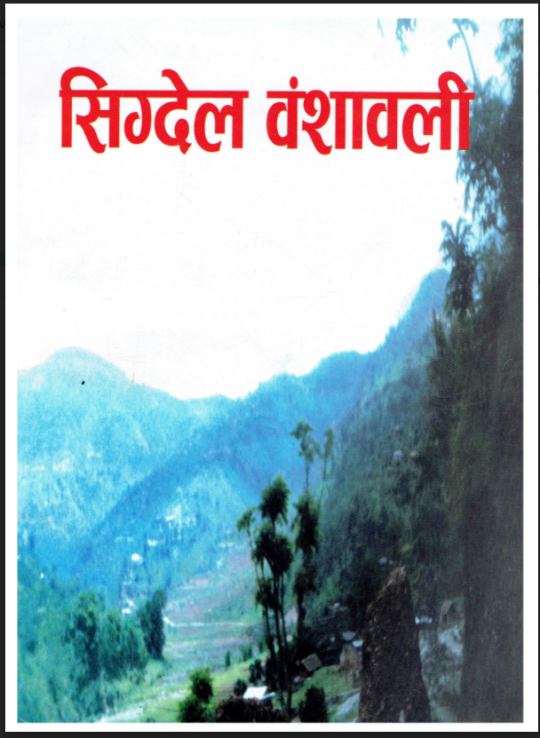

### प्रकाशकीय

 

#### बिसय सुची 

- प्रकाशकीय: 1-prakasakiya.md
- देउरालीमा एक थुँगा फूल: 2-deurali.md
- लेखकको कालमबाट: 3-lekhak.md
- संकलकको कलमबाट: 4-sankalak.md
- वंशावली को इतिहास: 5-sigdel-bamshawali.md
- मानव सृष्टिका विश्लेषणहरु: 6-manab.md
- वेदको परिचय: 7-bedh.md
- वंश इतिहास: 8-bamsaj.md
- आधुनिक सिग्देल वंशावली: 9-kul.md
- परिशिस्ट 

